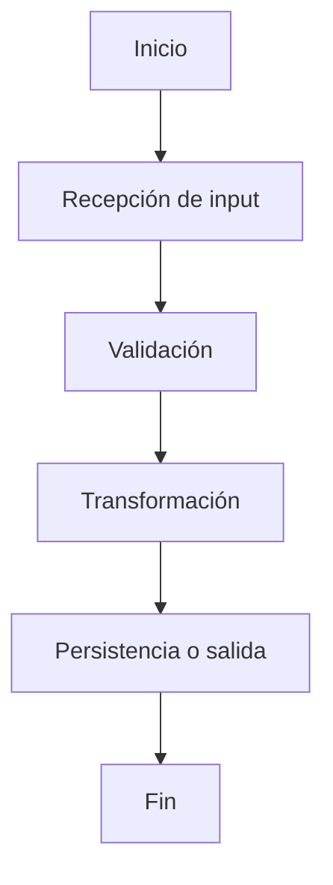

# AGENTS.md — Developer Kit

Este repositorio es un **toolkit de desarrollador**: prompts reutilizables para IA, plantillas de documentación (Jira, GitHub PRs), scaffolding de scripts Python para pipelines de datos (ETL, preprocesamiento, carga), snippets de VSCode y playbooks. **No es una aplicación ejecutable** — no tiene sistema de build, package manager ni test framework configurados.

---

## Stack tecnológico

| Capa | Tecnología |
|---|---|
| Scripts de datos | Python 3.9+ |
| Gestión de dependencias | pyproject.toml (setuptools) |
| Transformaciones / ETL | pandas>=2.0.0 |
| Tipado estático | mypy (modo strict) |
| Linter | Ruff |
| Formatter | Black (ancho 88) + isort |
| Tests | pytest + pytest-cov |
| TypeScript (snippets/templates) | ES modules, ESLint, Prettier |
| Documentación | Markdown + Mermaid (`flowchart TD`) |
| IDE | VSCode |
| Diagramas | Mermaid.js |
| Gestión de tickets | Jira |
| Control de versiones | GitHub |

---

## Estructura del repositorio

```
dev-kit/
├── .opencode/
│   └── commands/          # Comandos slash reutilizables para OpenCode
├── docs/
│   ├── decisions/         # ADRs — Architecture Decision Records
│   ├── standards/         # Estándares de documentación y naming
│   ├── workflows/         # Flujos de trabajo por tipo de tarea
│   └── kit-index.md       # Mapa maestro del kit
├── examples/
│   ├── docs/              # Documentación de ejemplo
│   ├── input/             # Datos de entrada de ejemplo
│   └── output/            # Salidas de ejemplo
├── playbooks/             # Checklists de proceso (delivery, jira, onboarding, PR, release)
├── prompts/               # Plantillas de prompt por categoría
│   ├── analysis/
│   ├── data/              # Prompts ETL, carga, profiling
│   ├── github/
│   ├── jira/
│   └── master/            # prompt-master.md — base para nuevos prompts
├── scripts/               # Scripts Python de datos
│   ├── data_quality/
│   │   ├── profile_dataset.py
│   │   └── validate_schema.py
│   ├── etl/
│   │   └── pipeline_etl.py
│   ├── load/
│   │   └── load.py
│   ├── preprocess/
│   │   └── preprocess.py
│   └── utils/
│       ├── file_utils.py
│       └── logger.py
├── skills/                # Definiciones de skill para IA
│   ├── analysis/
│   ├── data/
│   ├── jira/
│   └── pr/
├── snippets/              # Snippets de VSCode (.code-snippets)
├── templates/             # Plantillas Markdown de salida
│   ├── jira/              # jira-doc-template.md
│   └── pr/                # pr-doc-template.md
├── vscode/                # Configuración VSCode de referencia
│   ├── extensions/        # extensions-recommended.md
│   ├── keybindings/       # keybindings.json
│   ├── settings/          # settings.json
│   └── tasks/             # tasks.json
├── AGENTS.md
├── README.md
├── pyproject.toml
└── requirements.txt       # migrado — ver pyproject.toml
```

---

## Dónde están los scripts

Todos los scripts de datos viven en `scripts/`:

| Archivo | Propósito |
|---|---|
| `scripts/etl/pipeline_etl.py` | Pipeline completo: leer, validar, transformar, cargar |
| `scripts/preprocess/preprocess.py` | Normalización de columnas, limpieza y deduplicación |
| `scripts/load/load.py` | Carga de datos procesados a destino (CSV) |
| `scripts/data_quality/profile_dataset.py` | Profiling: filas, tipos, nulos, duplicados |
| `scripts/data_quality/validate_schema.py` | Validación de schema contra columnas esperadas |
| `scripts/utils/file_utils.py` | Helpers de lectura/escritura de archivos |
| `scripts/utils/logger.py` | Logger compartido con formato estándar |

---

## Dónde están los tests

Los tests aún no están creados. Cuando se agreguen, deben vivir en:

```
tests/
├── test_etl.py               # Tests para pipeline_etl.py
├── test_loader.py            # Tests para load.py
├── test_preprocess.py        # Tests para preprocess.py
└── conftest.py               # Fixtures compartidos de pytest
```

---

## Cómo correr el proyecto

Este repo no tiene servidor ni aplicación. Los scripts se ejecutan individualmente:

```bash
# Instalar dependencias (solo runtime)
pip install -e .

# Instalar dependencias de desarrollo (lint, tests, tipos)
pip install -e ".[dev]"

# ETL completo
python scripts/etl/pipeline_etl.py --input examples/input/data.csv --output examples/output/data_etl.csv

# Preprocesamiento
python scripts/preprocess/preprocess.py --input examples/input/data.csv --output examples/output/data_clean.csv

# Carga
python scripts/load/load.py --input examples/output/data_clean.csv --output examples/output/data_loaded.csv

# Profiling de dataset
python scripts/data_quality/profile_dataset.py --input examples/input/data.csv

# Validación de schema
python scripts/data_quality/validate_schema.py --input examples/input/data.csv
```

---

## Comandos de lint, formato y tests

```bash
# Lint
ruff check scripts/
flake8 scripts/
mypy scripts/

# Formato
black scripts/
isort scripts/

# Correr todos los tests
pytest

# Correr un archivo de test específico
pytest tests/test_etl.py

# Correr un test por nombre
pytest tests/test_etl.py::test_nombre_funcion -v

# Correr tests que coincidan con una palabra clave
pytest -k "transform" -v
```

Para TypeScript (cuando se agregue código en `snippets/` o `templates/typescript/`):

```bash
npm install
npm run build
npm run lint
npx jest --testNamePattern="nombre del test" path/to/file.test.ts
npx vitest run path/to/file.test.ts
```

---

## Convenciones de nombres

### Python

| Elemento | Convención | Ejemplo |
|---|---|---|
| Variables y funciones | `snake_case` | `process_date`, `order_id` |
| Clases | `PascalCase` | `EtlPipeline`, `DataLoader` |
| Constantes | `UPPER_SNAKE_CASE` | `MAX_RETRIES`, `REQUIRED_COLUMNS` |
| Archivos y módulos | `snake_case` | `pipeline_etl.py`, `file_utils.py` |
| Helpers privados | prefijo `_` | `_validate_schema` |
| Tests | prefijo `test_` | `test_transform_valid_record` |

### TypeScript

| Elemento | Convención | Ejemplo |
|---|---|---|
| Variables y funciones | `camelCase` | `processDate`, `orderId` |
| Clases, tipos, interfaces | `PascalCase` | `EtlPipeline`, `LoaderConfig` |
| Constantes reales | `UPPER_SNAKE_CASE` | `MAX_RETRIES` |
| Archivos | `kebab-case` | `pipeline-etl.ts` |

### Archivos de documentación

- Archivos Markdown: `kebab-case` (ej. `pr-doc-template.md`, `jira-doc-skill.md`)
- Snippets VSCode: `{lenguaje}.code-snippets`
- ADRs: `NNNN-titulo-kebab-case.md` (ej. `0001-record-architecture-decisions.md`)

---

## Estilo de código Python

### Imports (orden obligatorio)

```python
# 1. Librería estándar
import os
import sys
from datetime import datetime
from typing import Any, Optional

# 2. Paquetes de terceros
import pandas as pd
import sqlalchemy as sa

# 3. Módulos internos
from scripts.utils.file_utils import read_csv_file
from scripts.utils.logger import get_logger
```

### Type hints

```python
def transform(record: dict[str, Any], date: str) -> Optional[dict[str, Any]]:
    ...
```

- Siempre agregar type hints en firmas de funciones
- Usar `Optional[T]` o `T | None` para valores nulables
- Usar genéricos en minúscula (`dict[str, Any]`, `list[str]`) — Python 3.9+

### Manejo de errores

```python
# Respuesta de éxito
{"status": "success", "records_processed": 1250, "output_path": "/tmp/output.csv"}

# Respuesta de error
{"status": "error", "error_code": "MISSING_REQUIRED_COLUMN", "message": "No se encontró la columna order_id"}
```

- Usar siempre `status`, `error_code` y `message` en respuestas estructuradas
- Nunca usar `except:` sin tipo de excepción
- Validar inputs al inicio de cada función o script
- Loggear errores antes de relanzar o retornar

### Patrón de entrada de scripts

```python
if __name__ == "__main__":
    sys.exit(main())

def main() -> int:
    try:
        args = parse_args()
        # lógica principal
        return 0
    except Exception as exc:
        logger.exception("Script failed: %s", exc)
        return 1
```

---

## Cómo documentar

### Toda documentación nueva debe:

1. Estar escrita en **español**
2. Usar **Markdown** (`.md`)
3. Seguir la plantilla correspondiente en `templates/`
4. Incluir un **diagrama Mermaid** si documenta un script, ETL, integración o flujo multi-paso
5. Incluir ejemplos de **input y output en JSON** (caso exitoso + caso de error)

### Plantillas disponibles

| Tipo | Plantilla | Cuándo usarla |
|---|---|---|
| PR de GitHub | `templates/pr/pr-doc-template.md` | Toda PR que se abra |
| Ticket Jira | `templates/jira/jira-doc-template.md` | Todo ticket de Jira |
| ADR | `docs/decisions/0001-record-architecture-decisions.md` | Decisiones de arquitectura relevantes |

### Secciones obligatorias en PRs
Resumen · Archivos modificados (tabla) · Descripción detallada · Flujo funcional · Diagrama Mermaid · Datos utilizados · Contrato input/output · Reglas de negocio · Casos representativos · Riesgos · Pendientes · Referencias

### Secciones obligatorias en tickets Jira
Resumen · Objetivo · Contexto · Alcance · Flujo completo · Diagrama Mermaid · Funcionalidades implementadas · Datos utilizados · Input/Output con JSON · Formas de ejecución · Casos representativos · Pendientes · Criterios de aceptación

### Diagrama Mermaid estándar



---

## Prompts, skills y comandos OpenCode

| Carpeta | Propósito |
|---|---|
| `prompts/` | Plantillas de prompt para usar en cualquier IA; base: `prompts/master/prompt-master.md` |
| `skills/` | Instrucciones estructuradas: rol → reglas → estructura de salida → placeholders |
| `.opencode/commands/` | Comandos slash reutilizables directamente en OpenCode (ej. `/pr-doc`, `/jira-doc`) |

Al crear un prompt o skill nuevo, seguir la estructura existente; no dejar archivos vacíos.

---

## Convenciones generales

- **Idioma del contenido:** español (templates, skills, prompts, documentación)
- **Idioma del código:** inglés (nombres de variables, funciones, archivos)
- **Tablas:** pipe tables con fila de encabezado y separador `---`
- **Bloques de código:** siempre especificar el lenguaje (` ```python `, ` ```json `, ` ```sql `, ` ```mermaid `)
- **Archivos placeholder:** al implementar un scaffold vacío, implementar el módulo completo — no dejar archivos vacíos
