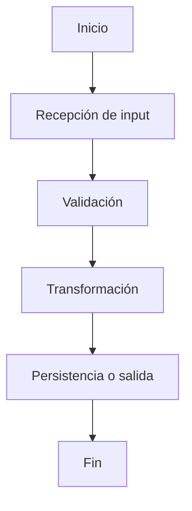

# AGENTS.md — Developer Kit

Este repositorio es un **toolkit de desarrollador**: prompts reutilizables para IA, plantillas de documentación (Jira, GitHub PRs), scaffolding de scripts Python para pipelines de datos (ETL, preprocesamiento, carga), snippets de VSCode y playbooks. **No es una aplicación ejecutable** — no tiene sistema de build, package manager ni test framework configurados.

---

## Stack tecnológico

| Capa | Tecnología |
|---|---|
| Scripts de datos | Python 3.9+ |
| Transformaciones / ETL | pandas, sqlalchemy (cuando se implementen) |
| Tipado estático | mypy (modo strict recomendado) |
| Linter | Ruff o Flake8 |
| Formatter | Black (ancho 88) + isort |
| Tests | pytest |
| TypeScript (snippets/templates) | ES modules, ESLint, Prettier |
| Documentación | Markdown + Mermaid (`flowchart TD`) |
| IDE | VSCode |
| Diagramas | Mermaid.js |
| Gestión de tickets | Jira |
| Control de versiones | GitHub |

---

## Estructura del repositorio

```
dev-kit/
├── examples/
│   ├── docs/          # Documentación de ejemplo
│   ├── input/         # Datos de entrada de ejemplo
│   └── output/        # Salidas de ejemplo
├── playbooks/         # Checklists de proceso (delivery, jira, onboarding, PR, release)
├── prompts/           # Plantillas de prompt por categoría
│   ├── analysis/      # Prompts de análisis
│   ├── data/          # Prompts ETL, carga, profiling
│   ├── github/        # Prompts para PRs
│   ├── jira/          # Prompts para tickets Jira
│   └── master/        # prompt-master.md — plantilla base para nuevos prompts
├── scripts/           # Scripts Python de datos (ver sección abajo)
├── skills/            # Definiciones de skill para IA (rol + reglas + estructura de salida)
│   ├── analysis/
│   ├── data/
│   ├── jira/
│   └── pr/
├── snippets/          # Snippets de VSCode (.code-snippets)
├── templates/         # Plantillas Markdown de salida
│   ├── jira/          # jira-doc-template.md
│   └── pr/            # pr-doc-template.md
└── vscode/            # Configuración VSCode (settings, keybindings, tasks, profiles)
```

---

## Dónde están los scripts

Todos los scripts de datos viven en `scripts/`:

```
scripts/
├── etl/
│   └── pipeline_etl.py      # Lógica de transformación principal
├── load/
│   └── loader.py             # Carga de datos a destino
├── preprocess/
│   └── preprocess.py         # Preprocesamiento y limpieza
├── data_quality/             # Checks de calidad de datos
└── utils/                    # Helpers y utilidades compartidas
```

---

## Dónde están los tests

Los tests aún no están creados. Cuando se agreguen, deben vivir en:

```
tests/
├── test_etl.py               # Tests para pipeline_etl.py
├── test_loader.py            # Tests para loader.py
├── test_preprocess.py        # Tests para preprocess.py
└── conftest.py               # Fixtures compartidos de pytest
```

---

## Cómo correr el proyecto

Este repo no tiene servidor ni aplicación. Los scripts se ejecutan individualmente:

```bash
# Instalar dependencias (cuando se agregue requirements.txt)
pip install -r requirements.txt

# Ejecutar un script específico con argumento de fecha
python scripts/etl/pipeline_etl.py --process_date 2026-03-17
python scripts/preprocess/preprocess.py --process_date 2026-03-17
python scripts/load/loader.py --process_date 2026-03-17
```

---

## Comandos de lint, formato y tests

```bash
# Lint
ruff check scripts/
flake8 scripts/
mypy scripts/

# Formato
black scripts/
isort scripts/

# Correr todos los tests
pytest

# Correr un archivo de test específico
pytest tests/test_etl.py

# Correr un test por nombre
pytest tests/test_etl.py::test_nombre_funcion -v

# Correr tests que coincidan con una palabra clave
pytest -k "transform" -v
```

Para TypeScript (cuando se agregue código en `snippets/` o `templates/typescript/`):

```bash
npm install
npm run build
npm run lint
npx jest --testNamePattern="nombre del test" path/to/file.test.ts
npx vitest run path/to/file.test.ts
```

---

## Convenciones de nombres

### Python

| Elemento | Convención | Ejemplo |
|---|---|---|
| Variables y funciones | `snake_case` | `process_date`, `order_id` |
| Clases | `PascalCase` | `EtlPipeline`, `DataLoader` |
| Constantes | `UPPER_SNAKE_CASE` | `MAX_RETRIES`, `DEFAULT_PATH` |
| Archivos y módulos | `snake_case` | `pipeline_etl.py`, `data_loader.py` |
| Helpers privados | prefijo `_` | `_validate_schema` |
| Tests | prefijo `test_` | `test_transform_valid_record` |

### TypeScript

| Elemento | Convención | Ejemplo |
|---|---|---|
| Variables y funciones | `camelCase` | `processDate`, `orderId` |
| Clases, tipos, interfaces | `PascalCase` | `EtlPipeline`, `LoaderConfig` |
| Constantes reales | `UPPER_SNAKE_CASE` | `MAX_RETRIES` |
| Archivos | `kebab-case` | `pipeline-etl.ts` |

### Archivos de documentación

- Archivos Markdown: `kebab-case` (ej. `pr-doc-template.md`, `jira-doc-skill.md`)
- Snippets VSCode: `{lenguaje}.code-snippets`

---

## Estilo de código Python

### Imports (orden obligatorio)

```python
# 1. Librería estándar
import os
import sys
from datetime import datetime
from typing import Any, Optional

# 2. Paquetes de terceros
import pandas as pd
import sqlalchemy as sa

# 3. Módulos internos
from scripts.utils.helpers import validate_input
```

### Type hints

```python
def transform(record: dict[str, Any], date: str) -> Optional[dict[str, Any]]:
    ...
```

- Siempre agregar type hints en firmas de funciones
- Usar `Optional[T]` o `T | None` para valores nulables
- Usar genéricos en minúscula (`dict[str, Any]`, `list[str]`) — Python 3.9+

### Manejo de errores

```python
# Respuesta de éxito
{"status": "success", "records_processed": 1250, "output_path": "/tmp/output.csv"}

# Respuesta de error
{"status": "error", "error_code": "MISSING_REQUIRED_COLUMN", "message": "No se encontró la columna order_id"}
```

- Usar siempre `status`, `error_code` y `message` en respuestas estructuradas
- Nunca usar `except:` sin tipo de excepción
- Validar inputs al inicio de cada función o script
- Loggear errores antes de relanzar o retornar

### Patrón de entrada de scripts

```python
if __name__ == "__main__":
    import argparse
    parser = argparse.ArgumentParser()
    parser.add_argument("--process_date", required=True)
    args = parser.parse_args()
    result = main(process_date=args.process_date)
    print(result)
```

---

## Cómo documentar

### Toda documentación nueva debe:

1. Estar escrita en **español**
2. Usar **Markdown** (`.md`)
3. Seguir la plantilla correspondiente en `templates/`
4. Incluir un **diagrama Mermaid** si documenta un script, ETL, integración o flujo multi-paso
5. Incluir ejemplos de **input y output en JSON** (caso exitoso + caso de error)

### Plantillas disponibles

| Tipo | Plantilla | Cuándo usarla |
|---|---|---|
| PR de GitHub | `templates/pr/pr-doc-template.md` | Toda PR que se abra |
| Ticket Jira | `templates/jira/jira-doc-template.md` | Todo ticket de Jira |

### Secciones obligatorias en PRs
Resumen · Archivos modificados (tabla) · Descripción detallada · Flujo funcional · Diagrama Mermaid · Datos utilizados · Contrato input/output · Reglas de negocio · Casos representativos · Riesgos · Pendientes · Referencias

### Secciones obligatorias en tickets Jira
Resumen · Objetivo · Contexto · Alcance · Flujo completo · Diagrama Mermaid · Funcionalidades implementadas · Datos utilizados · Input/Output con JSON · Formas de ejecución · Casos representativos · Pendientes · Criterios de aceptación

### Diagrama Mermaid estándar



---

## Prompts y skills

- **Prompts** en `prompts/` — usar `prompts/master/prompt-master.md` como base para cualquier prompt nuevo
- **Skills** en `skills/` — estructura: declaración de rol → reglas obligatorias → estructura de salida → placeholders de contexto
- Al crear un prompt o skill nuevo, seguir la estructura existente; no dejar archivos vacíos

---

## Convenciones generales

- **Idioma del contenido:** español (templates, skills, prompts, documentación)
- **Idioma del código:** inglés (nombres de variables, funciones, archivos)
- **Tablas:** pipe tables con fila de encabezado y separador `---`
- **Bloques de código:** siempre especificar el lenguaje (` ```python `, ` ```json `, ` ```sql `, ` ```mermaid `)
- **Archivos placeholder:** al implementar un scaffold vacío (ej. `scripts/etl/pipeline_etl.py`), implementar el módulo completo — no dejar archivos vacíos
