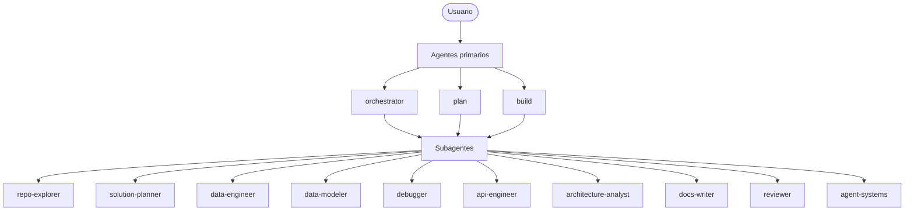

# Estrategia de Agentes — Dev Kit

Este documento describe el sistema de agentes de OpenCode configurado en el dev-kit: su propósito, cuándo usar cada uno, sus permisos y las diferencias entre agentes similares.

---

## Visión general

El sistema de agentes del dev-kit está diseñado para una desarrolladora fullstack junior que trabaja en múltiples proyectos. Los agentes cubren los dominios más frecuentes del trabajo diario: exploración de repositorios, planificación, implementación de datos, documentación, revisión y diseño de arquitectura.

---

## Agentes primarios

Los agentes primarios son accesibles directamente desde la interfaz de OpenCode y pueden delegar en subagentes.

### `plan`

| Campo | Valor |
|---|---|
| Modo | primary |
| Temperatura | 0.3 |
| Puede editar | No |
| Puede ejecutar bash | Solo lectura (ls, git log, git diff) |

**Propósito**: Analizar, planificar y diseñar soluciones antes de implementar. No modifica archivos.

**Inputs**: Requerimiento del usuario, acceso de lectura al repositorio.

**Outputs**: Plan de acción estructurado con tareas, criterios de aceptación y riesgos.

**Cuándo usar**:
- Antes de empezar una feature para entender qué cambiar
- Para planificar el fix de un bug complejo
- Para diseñar la estructura de un nuevo script o módulo

---

### `build`

| Campo | Valor |
|---|---|
| Modo | primary |
| Temperatura | 0.2 |
| Puede editar | Sí |
| Puede ejecutar bash | Python, pip, lint, tests |

**Propósito**: Implementar código, scripts y archivos siguiendo las convenciones del dev-kit.

**Inputs**: Plan o requerimiento, archivos a crear/modificar.

**Outputs**: Código Python, configuraciones, templates.

**Cuándo usar**:
- Para implementar un script ETL, preprocesamiento o carga
- Para agregar funcionalidad a un script existente
- Para ejecutar lint y tests sobre el código implementado

---

### `orchestrator`

| Campo | Valor |
|---|---|
| Modo | primary |
| Temperatura | 0.2 |
| Puede editar | Preguntar antes |
| Puede invocar task | Todos los subagentes |

**Propósito**: Coordinar tareas complejas descomponiéndolas y delegando en subagentes especializados.

**Inputs**: Tarea compleja multi-dominio.

**Outputs**: Resultado integrado de múltiples subagentes.

**Cuándo usar**:
- Cuando la tarea involucra más de un dominio (datos + docs + revisión)
- Para flujos end-to-end desde análisis hasta documentación
- Cuando no es claro qué agente debe manejar una solicitud

---

## Subagentes

Los subagentes son invocados mediante la herramienta Task y no aparecen directamente en el autocomplete `@` (excepto cuando se usan con `@`).

---

### `repo-explorer`

| Campo | Valor |
|---|---|
| Modo | subagent |
| Puede editar | No |
| Puede ejecutar bash | Solo lectura |

**Propósito**: Explorar y analizar el repositorio sin modificar nada.

**Inputs**: Pregunta sobre el repositorio o instrucción de exploración.

**Outputs**: Mapa de archivos, hallazgos con evidencia (ruta:línea), brechas y próximos pasos.

**Cuándo usar**:
- Para entender la estructura del repositorio antes de planificar
- Para responder preguntas sobre "qué existe" y "cómo está organizado"
- Como primer paso antes de delegar en `solution-planner` o `data-engineer`

---

### `solution-planner`

| Campo | Valor |
|---|---|
| Modo | subagent |
| Puede editar | No |
| Puede ejecutar bash | Solo lectura |

**Propósito**: Diseñar soluciones técnicas, planificar fases e identificar riesgos sin escribir código.

**Inputs**: Requerimiento o problema a resolver.

**Outputs**: Plan con componentes, fases priorizadas, riesgos y preguntas abiertas.

**Cuándo usar**:
- Para diseñar la solución antes de empezar a codificar
- Para crear una tarjeta Jira robusta antes de implementar
- Para dividir un proyecto en fases con criterios de aceptación

---

### `data-engineer`

| Campo | Valor |
|---|---|
| Modo | subagent |
| Puede editar | Sí |
| Puede ejecutar bash | Python, pip, lint |

**Propósito**: Implementar y mejorar scripts de ETL, preprocesamiento, carga y calidad de datos.

**Inputs**: Requerimiento de script, schema de datos, descripción del pipeline.

**Outputs**: Scripts Python en `scripts/` siguiendo las convenciones del dev-kit.

**Cuándo usar**:
- Para crear un nuevo script ETL o de preprocesamiento
- Para agregar validaciones o transformaciones a un script existente
- Para refactorizar código de datos que no cumple las convenciones

---

### `data-modeler`

| Campo | Valor |
|---|---|
| Modo | subagent |
| Puede editar | Sí (solo docs/schemas) |
| Puede ejecutar bash | Solo lectura |

**Propósito**: Diseñar schemas, modelos de datos y contratos de entrada/salida.

**Inputs**: Descripción de la fuente de datos, requerimientos del pipeline.

**Outputs**: Schemas JSON, TypedDicts, contratos con ejemplos representativos.

**Cuándo usar**:
- Antes de implementar un ETL para definir las columnas esperadas
- Para documentar el contrato de un dataset o API
- Para revisar si un schema existente cubre todos los casos de uso

---

### `debugger`

| Campo | Valor |
|---|---|
| Modo | subagent |
| Puede editar | Preguntar antes |
| Puede ejecutar bash | Python (lectura), lint |

**Propósito**: Investigar bugs y errores de forma estructurada antes de proponer fixes.

**Inputs**: Stack trace, descripción del error, código relevante.

**Outputs**: Análisis estructurado con hipótesis, pasos de validación, solución propuesta y riesgos.

**Cuándo usar**:
- Cuando hay un error con causa raíz no clara
- Antes de aplicar un fix para asegurarse de entender el problema
- Para generar documentación del bug y su resolución

---

### `api-engineer`

| Campo | Valor |
|---|---|
| Modo | subagent |
| Puede editar | Sí |
| Puede ejecutar bash | Python, lint |

**Propósito**: Diseñar e implementar endpoints, contratos de API y manejo de errores.

**Inputs**: Descripción del endpoint o API a diseñar/implementar.

**Outputs**: Código de endpoints, contratos request/response, estándares de error.

**Cuándo usar**:
- Para diseñar una nueva API o endpoint desde cero
- Para estandarizar el manejo de errores en una API existente
- Para definir el contrato de integración entre servicios

---

### `architecture-analyst`

| Campo | Valor |
|---|---|
| Modo | subagent |
| Puede editar | Sí (solo docs/) |
| Puede ejecutar bash | Solo lectura |

**Propósito**: Documentar arquitecturas existentes con C4, diagramas Mermaid y ADRs.

**Inputs**: Código existente, descripción del sistema.

**Outputs**: Documentación C4, ADRs en `docs/decisions/`, diagramas Mermaid.

**Cuándo usar**:
- Para documentar la arquitectura de un sistema antes de hacer onboarding
- Para registrar una decisión arquitectural importante como ADR
- Para crear una vista de arquitectura para una PR o presentación

---

### `docs-writer`

| Campo | Valor |
|---|---|
| Modo | subagent |
| Puede editar | Sí |
| Puede ejecutar bash | Solo git (lectura) |

**Propósito**: Redactar documentación técnica en español usando las plantillas del dev-kit.

**Inputs**: Contexto del cambio, código implementado, tipo de documento.

**Outputs**: PRs, tickets Jira, ADRs, workflows en Markdown.

**Cuándo usar**:
- Para generar la documentación de una PR antes de abrirla
- Para redactar una tarjeta Jira completa y robusta
- Para actualizar workflows o documentación interna

---

### `reviewer`

| Campo | Valor |
|---|---|
| Modo | subagent |
| Puede editar | No |
| Puede ejecutar bash | Solo lectura y lint |

**Propósito**: Revisar código o documentos con criterio técnico y entregar hallazgos priorizados.

**Inputs**: Archivos a revisar, contexto del cambio.

**Outputs**: Informe de hallazgos con severidad (crítico / mayor / menor / sugerencia) y evidencia (ruta:línea).

**Cuándo usar**:
- Antes de hacer merge de un PR para una revisión final
- Después de que `data-engineer` implementa un script
- Para auditar el estado de calidad del repositorio

---

### `agent-systems`

| Campo | Valor |
|---|---|
| Modo | subagent |
| Puede editar | Sí (solo .opencode/agents/ y docs/) |
| Puede ejecutar bash | Solo lectura |
| Puede hacer webfetch | Sí |

**Propósito**: Diseñar, evaluar y mejorar el stack de agentes del dev-kit.

**Inputs**: Descripción de un gap, agente a revisar, caso de uso no cubierto.

**Outputs**: Nuevos archivos de agentes, propuestas de mejora, documentación actualizada.

**Cuándo usar**:
- Cuando un agente existente no cubre un caso de uso importante
- Para revisar si el sistema de agentes está bien balanceado
- Para agregar un nuevo dominio al dev-kit

---

## Diferencias entre agentes similares

### `solution-planner` vs `architecture-analyst`

| Dimensión | `solution-planner` | `architecture-analyst` |
|---|---|---|
| Orientación temporal | Futuro (qué construir) | Presente/pasado (qué existe) |
| Input principal | Requerimiento o problema | Código o sistema existente |
| Output principal | Plan, fases, tareas | Docs C4, ADRs, diagramas |
| Modifica archivos | No | Sí (solo docs/) |
| Requiere código existente | No | Sí |

### `data-engineer` vs `data-modeler`

| Dimensión | `data-engineer` | `data-modeler` |
|---|---|---|
| Foco | Procesamiento de datos | Estructura de datos |
| Output | Scripts Python | Schemas, contratos, TypedDicts |
| Cuándo actúa | Durante y después del diseño | Antes de implementar |
| Modifica `scripts/` | Sí | No |

### `docs-writer` vs `reviewer`

| Dimensión | `docs-writer` | `reviewer` |
|---|---|---|
| Acción | Escribe y crea | Lee y evalúa |
| Output | Documentos nuevos o actualizados | Informe de hallazgos |
| Modifica archivos | Sí | No |
| Scope | Solo documentación | Código y documentación |

---

## Fases de adopción recomendadas

### Fase 1 — Fundamentos

Empezar con los agentes que cubren las tareas más frecuentes:

| Agente | Tarea más común |
|---|---|
| `docs-writer` | Generar PR y Jira antes de abrir tickets |
| `repo-explorer` | Explorar repositorios desconocidos al empezar |
| `solution-planner` | Planificar features antes de codificar |
| `debugger` | Analizar errores antes de aplicar fixes |

### Fase 2 — Datos y calidad

Agregar los agentes de implementación y revisión:

| Agente | Tarea más común |
|---|---|
| `data-engineer` | Crear o mejorar scripts ETL y de preprocesamiento |
| `api-engineer` | Diseñar endpoints y contratos de integración |
| `reviewer` | Revisar PRs antes de hacer merge |

### Fase 3 — Arquitectura avanzada

Incorporar los agentes de diseño estructural:

| Agente | Tarea más común |
|---|---|
| `architecture-analyst` | Documentar la arquitectura de un servicio |
| `data-modeler` | Definir schemas antes de implementar pipelines |
| `agent-systems` | Evolucionar y mantener el stack de agentes |

---

## Referencia de archivos del sistema de agentes

| Archivo | Propósito |
|---|---|
| `.opencode/agents/orchestrator.md` | Coordinador primario multi-agente |
| `.opencode/agents/plan.md` | Planificación y análisis (primario) |
| `.opencode/agents/build.md` | Implementación y código (primario) |
| `.opencode/agents/repo-explorer.md` | Exploración de repositorio |
| `.opencode/agents/solution-planner.md` | Diseño de soluciones |
| `.opencode/agents/data-engineer.md` | Scripts de datos |
| `.opencode/agents/data-modeler.md` | Schemas y contratos |
| `.opencode/agents/debugger.md` | Debugging estructurado |
| `.opencode/agents/api-engineer.md` | Endpoints y APIs |
| `.opencode/agents/architecture-analyst.md` | Docs C4 y ADRs |
| `.opencode/agents/docs-writer.md` | Documentación técnica |
| `.opencode/agents/reviewer.md` | Revisión de código y docs |
| `.opencode/agents/agent-systems.md` | Evolución del stack |
| `docs/agent-strategy.md` | Este documento |
| `docs/workflows/opencode-workflow.md` | Workflows de uso por tipo de tarea |
| `docs/workflows/solution-planning-workflow.md` | Cómo usar `solution-planner` |
