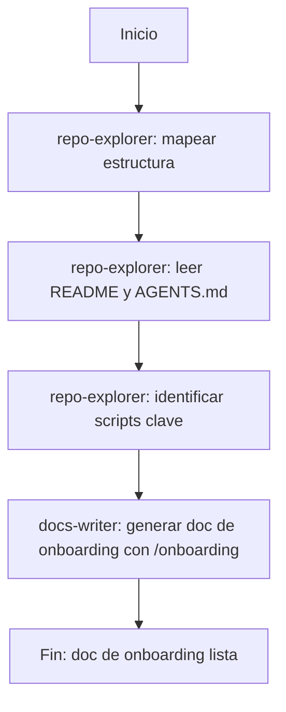
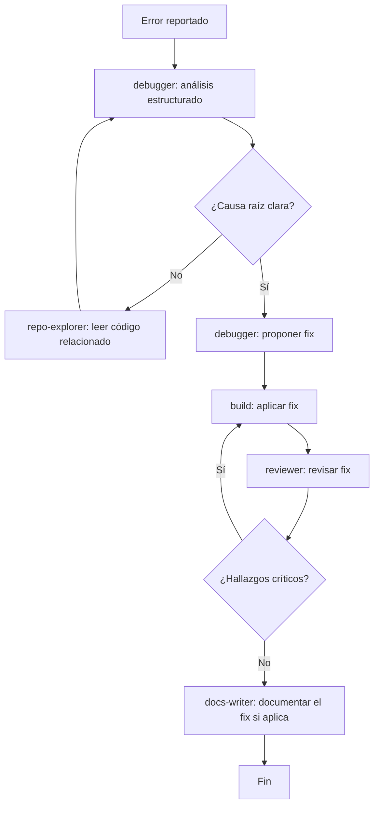
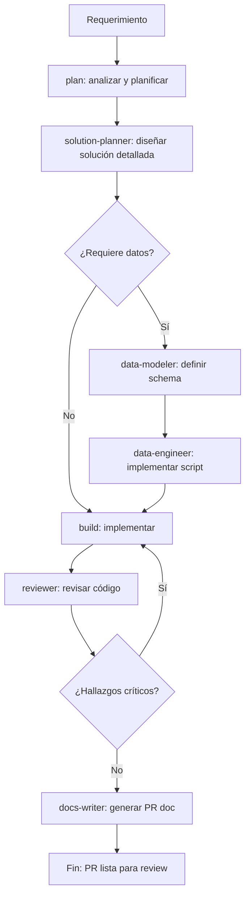
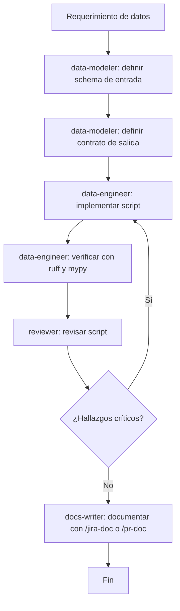
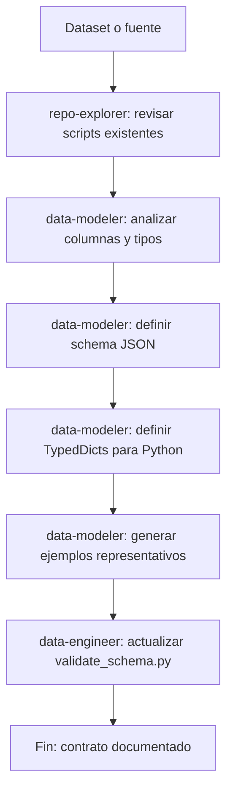
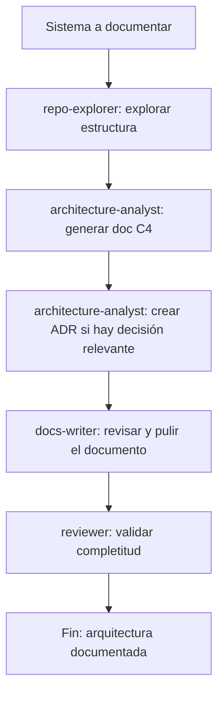
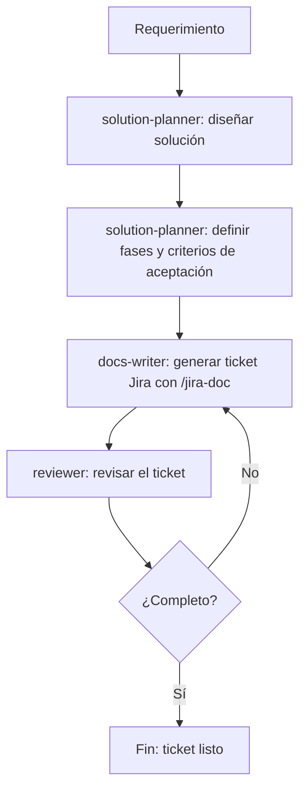
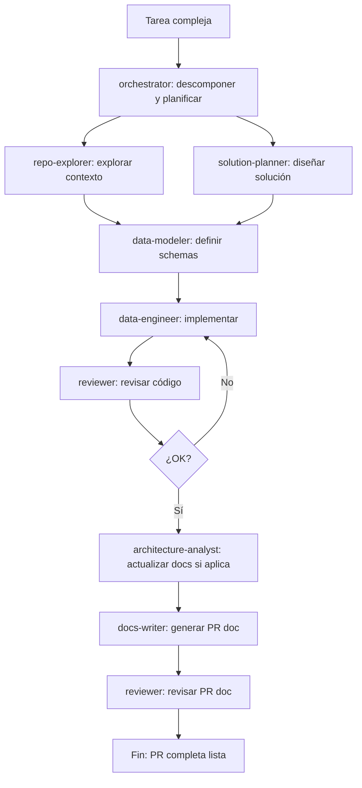

# Workflows de OpenCode — Dev Kit

Guía de referencia sobre cómo usar los agentes de OpenCode para cada tipo de tarea en el dev-kit.

---

## Índice

1. [Onboarding a un repositorio nuevo](#1-onboarding-a-un-repositorio-nuevo)
2. [Bugfix](#2-bugfix)
3. [Nueva feature](#3-nueva-feature)
4. [Tarea de datos (ETL / preprocesamiento / carga)](#4-tarea-de-datos)
5. [Modelado de datos](#5-modelado-de-datos)
6. [Documentación de arquitectura](#6-documentación-de-arquitectura)
7. [Planificación de ticket o proyecto](#7-planificación-de-ticket-o-proyecto)
8. [Flujo combinado completo](#8-flujo-combinado-completo)

---

## 1. Onboarding a un repositorio nuevo

**Objetivo**: Entender rápidamente un repositorio desconocido antes de trabajar en él.

**Pasos**:

1. Usar `@repo-explorer`: "Explora este repositorio y dame un mapa completo de su estructura, propósito y archivos clave."
2. Preguntar al `@repo-explorer`: "¿Qué deuda técnica o brechas existen?"
3. Usar `/onboarding` con `@docs-writer` para generar la documentación de onboarding.

**Comandos útiles**: `/deep-analysis`, `/onboarding`

---

## 2. Bugfix

**Objetivo**: Investigar un error, entender su causa raíz y aplicar un fix correcto.

**Pasos**:

1. Usar `/debugging` con `@debugger`: proporcionar el stack trace y el comportamiento observado.
2. Si el debugger necesita más contexto, usar `@repo-explorer` para leer el código relacionado.
3. Una vez identificada la causa raíz, dejar que `@debugger` proponga el fix.
4. Usar `@build` para aplicar el fix.
5. Usar `@reviewer` para revisar antes de hacer commit.
6. Si es un bug con impacto significativo, usar `@docs-writer` para documentarlo.

**Comandos útiles**: `/debugging`

---

## 3. Nueva feature

**Objetivo**: Planificar e implementar una nueva funcionalidad de manera ordenada.

**Pasos**:

1. Usar `@plan`: "Planifica la implementación de [feature]."
2. Usar `@solution-planner` para el diseño detallado si es complejo.
3. Si hay datos involucrados: `@data-modeler` para schemas, luego `@data-engineer` para implementar.
4. Usar `@build` para implementar el código general.
5. Usar `@reviewer` para revisar antes de la PR.
6. Usar `/pr-doc` con `@docs-writer` para generar la documentación de la PR.

**Comandos útiles**: `/pr-doc`, `/pipeline-etl`

---

## 4. Tarea de datos

**Objetivo**: Implementar o mejorar un script ETL, de preprocesamiento o de carga.

**Pasos**:

1. Usar `@data-modeler`: "Define el schema de entrada y el contrato de salida para [descripción del dataset]."
2. Usar `@data-engineer`: "Implementa un script que [descripción del pipeline] usando el schema definido."
3. Verificar que el script siga las convenciones: `ruff check`, `mypy`, `black`, `isort`.
4. Usar `@reviewer` para una revisión final.
5. Documentar con `/pipeline-etl` o `/jira-doc`.

**Scripts base disponibles**:

| Script | Reutilizar para |
|---|---|
| `scripts/etl/pipeline_etl.py` | Pipeline completo |
| `scripts/preprocess/preprocess.py` | Limpieza y normalización |
| `scripts/load/load.py` | Carga a destino |
| `scripts/data_quality/profile_dataset.py` | Profiling |
| `scripts/data_quality/validate_schema.py` | Validación de schema |

**Comandos útiles**: `/pipeline-etl`, `/data-profile`

---

## 5. Modelado de datos

**Objetivo**: Definir la estructura de un dataset o contrato de datos antes de implementar.

**Pasos**:

1. Usar `@repo-explorer` para ver los scripts existentes y qué columnas ya están definidas.
2. Usar `@data-modeler`: "Define el schema para [nombre del dataset] con columnas, tipos y restricciones."
3. Pedir al `@data-modeler` los TypedDicts de Python para usar en el código.
4. Pedir los ejemplos representativos (éxito, error, edge case).
5. Usar `@data-engineer` para actualizar `validate_schema.py` con el nuevo schema.

**Comandos útiles**: `/data-profile`

---

## 6. Documentación de arquitectura

**Objetivo**: Documentar la arquitectura de un sistema o servicio existente.

**Pasos**:

1. Usar `@repo-explorer` para obtener un mapa completo del sistema.
2. Usar `/architecture-doc` con `@architecture-analyst`: "Documenta la arquitectura de este sistema con C4 y diagramas Mermaid."
3. Si hay decisiones de diseño relevantes: `@architecture-analyst` para crear un ADR en `docs/decisions/`.
4. Usar `@docs-writer` para pulir el lenguaje y verificar que siga la plantilla.
5. Usar `@reviewer` para validar que la documentación esté completa.

**Comandos útiles**: `/architecture-doc`, `/adr`

---

## 7. Planificación de ticket o proyecto

**Objetivo**: Redactar un ticket Jira robusto o planificar un proyecto antes de implementar.

**Pasos**:

1. Usar `@solution-planner`: "Planifica la solución para [requerimiento]."
2. Pedir al `@solution-planner` que defina las fases, criterios de aceptación y riesgos.
3. Usar `/jira-doc` con `@docs-writer` para generar el ticket con toda la información.
4. Usar `@reviewer` para verificar que el ticket esté completo antes de abrirlo en Jira.

**Comandos útiles**: `/jira-doc`

---

## 8. Flujo combinado completo

**Objetivo**: Ejecutar un flujo end-to-end desde análisis hasta PR documentada.

Este flujo aplica cuando hay una tarea compleja que involucra múltiples dominios. Usar `@orchestrator` para coordinarlo.

**Pasos**:

1. Usar `@orchestrator`: "Necesito [descripción completa de la tarea]. Coordina los agentes necesarios."
2. El orquestador descompone la tarea y delega en el orden apropiado.
3. Revisar los resultados parciales de cada subagente.
4. El resultado final es una PR documentada y revisada.

**Cuándo usar el orquestador**:
- La tarea involucra datos + API + documentación
- No es claro qué agente debe manejar la solicitud
- Se necesita un flujo end-to-end sin intervención manual en cada paso

---

## Referencia rápida: agente por tipo de pregunta

| Pregunta / Tarea | Agente a usar |
|---|---|
| "¿Qué hay en este repositorio?" | `@repo-explorer` |
| "¿Cómo debería resolver este problema?" | `@solution-planner` |
| "Implementa este script ETL" | `@data-engineer` |
| "Define el schema de este dataset" | `@data-modeler` |
| "Tengo este error, ayúdame" | `@debugger` |
| "Diseña este endpoint" | `@api-engineer` |
| "Documenta esta arquitectura" | `@architecture-analyst` |
| "Escribe la doc de esta PR" | `@docs-writer` + `/pr-doc` |
| "Revisa este código antes del merge" | `@reviewer` |
| "Mejora el sistema de agentes" | `@agent-systems` |
| "Haz todo esto junto" | `@orchestrator` |
