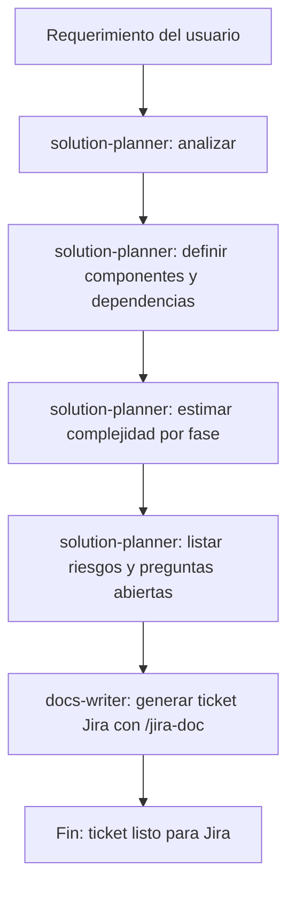
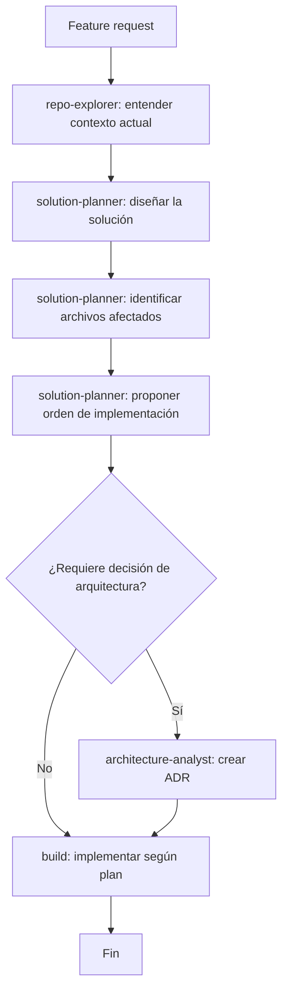
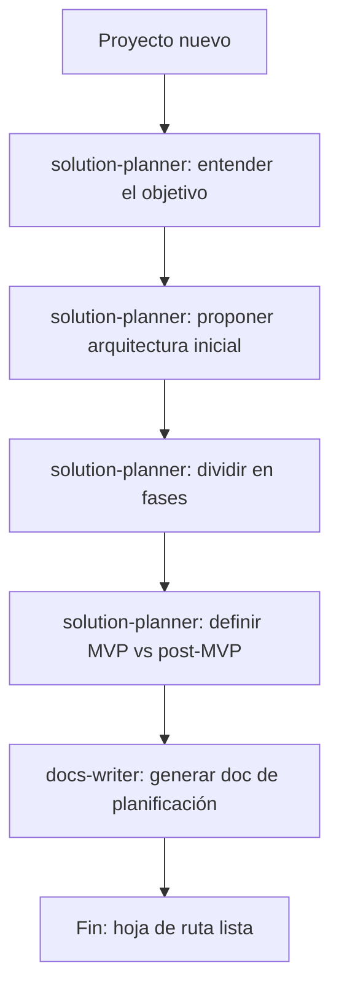
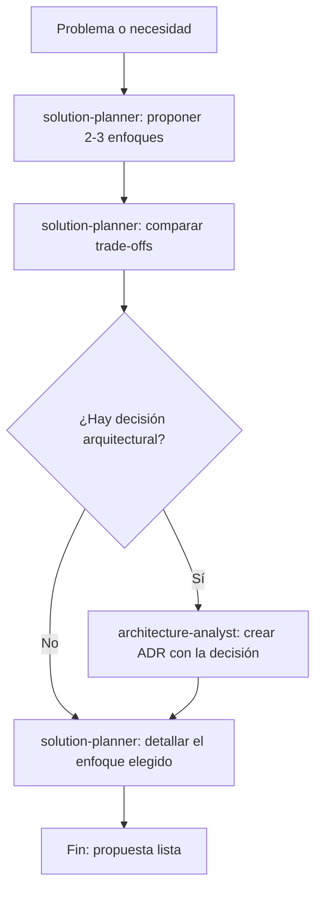

# Workflow de Planificación de Soluciones — Dev Kit

Guía de uso del agente `solution-planner` para planificar features, proyectos, arquitecturas y tickets Jira antes de escribir código.

---

## Cuándo usar `solution-planner`

El `solution-planner` es el primer agente a usar cuando:

- Tenés un requerimiento nuevo y no sabés por dónde empezar
- Necesitás dividir un proyecto grande en fases manejables
- Querés crear una tarjeta Jira robusta antes de codificar
- Necesitás identificar riesgos y dependencias antes de comprometerte con una solución
- Querés proponer una arquitectura inicial sin documentar lo que ya existe

**Diferencia clave con otros agentes**:

| Agente | Qué hace |
|---|---|
| `solution-planner` | Planifica qué construir y cómo (orientado a futuro) |
| `architecture-analyst` | Documenta lo que ya existe (orientado a presente) |
| `repo-explorer` | Explora el estado actual sin planificar |
| `build` | Implementa lo que ya fue planificado |

---

## Caso 1: Planificar una tarjeta Jira

**Cuándo**: Antes de abrir un ticket en Jira para una feature o mejora.



**Prompt de ejemplo**:
```
@solution-planner Planifica la implementación de un pipeline ETL que lea 
pedidos desde un CSV, valide el schema, normalice las fechas y cargue el 
resultado en otro CSV. El input tiene columnas: order_id, amount, date, status.
```

**Output esperado del agente**:
1. Resumen del problema
2. Componentes involucrados (scripts existentes a reutilizar, nuevos a crear)
3. Fases: Fase 1 - Validación, Fase 2 - Transformación, Fase 3 - Carga
4. Dependencias (ej. `validate_schema.py` debe existir antes de implementar el pipeline)
5. Riesgos (ej. encoding del CSV, columnas opcionales vs requeridas)
6. Preguntas abiertas (ej. ¿qué pasa con registros con `amount` nulo?)
7. Criterios de aceptación por fase

---

## Caso 2: Planificar una feature

**Cuándo**: Antes de implementar una nueva funcionalidad en un proyecto existente.



**Prompt de ejemplo**:
```
@solution-planner Quiero agregar soporte para múltiples formatos de input 
(CSV, JSON, Parquet) al script pipeline_etl.py. Diseña la solución sin 
modificar la interfaz de línea de comandos existente.
```

**Lo que debe incluir el plan**:
- Patrón de diseño propuesto (ej. strategy pattern para readers)
- Archivos a crear vs modificar
- Impacto en los scripts existentes (`file_utils.py`, `pipeline_etl.py`)
- Orden de implementación recomendado
- Tests que deberían agregarse

---

## Caso 3: Planificar un proyecto pequeño

**Cuándo**: Tenés un proyecto nuevo desde cero y necesitás una hoja de ruta.



**Prompt de ejemplo**:
```
@solution-planner Necesito construir un sistema de monitoreo de calidad de datos 
que ejecute validaciones diarias sobre un dataset de ventas, genere reportes en 
Markdown y envíe alertas cuando detecte anomalías. Propone una arquitectura inicial 
y divídelo en fases. Solo tenemos Python disponible, sin infraestructura cloud.
```

**Output esperado**:
```markdown
## Plan: Sistema de Monitoreo de Calidad de Datos

### Resumen
...

### Arquitectura propuesta
Componente 1: Scheduler (cron o script con argparse --date)
Componente 2: Validador (extiende validate_schema.py existente)
Componente 3: Analizador de anomalías (nuevas funciones estadísticas)
Componente 4: Generador de reportes Markdown
Componente 5: Notificador (email via smtplib o webhook)

### Fases

**Fase 1 — MVP** (complejidad: baja)
- Scheduler básico con argparse
- Validaciones existentes de schema
- Reporte Markdown simple
- Criterio: ejecutable manualmente con `python monitor.py --date 2024-01-15`

**Fase 2 — Anomalías** (complejidad: media)
- Detección de outliers estadísticos
- Comparación con baseline histórico
- Criterio: genera alertas cuando amount > 3 desviaciones estándar

**Fase 3 — Notificaciones** (complejidad: media)
- Integración con email o Slack webhook
- Criterio: alerta recibida en < 5 minutos del run

### Riesgos
- Definir qué es una "anomalía" requiere criterio de negocio: preguntar antes de Fase 2
- Email puede bloquearse por firewalls corporativos: tener webhook como fallback

### Preguntas abiertas
1. ¿Qué columnas del dataset son las más críticas para monitorear?
2. ¿A quién se notifica? ¿Email, Slack, ambos?
3. ¿Cuántos días de histórico usar como baseline?
```

---

## Caso 4: Propuesta de arquitectura inicial

**Cuándo**: Necesitás una propuesta de alto nivel para presentar antes de decidir cómo construir algo.



**Prompt de ejemplo**:
```
@solution-planner Necesito decidir si el pipeline ETL debe ejecutarse como 
script Python standalone, como DAG de Airflow, o como función Lambda. 
Tenemos Python 3.9, no tenemos Airflow instalado y el volumen es ~50k registros/día. 
Compara los enfoques y recomienda uno.
```

**Output esperado**: tabla comparativa de enfoques con pros/contras, recomendación justificada, y si la decisión es suficientemente importante, derivar a `@architecture-analyst` para crear un ADR.

---

## Caso 5: Desglose en fases con criterios de aceptación

**Cuándo**: Tenés una solución propuesta y necesitás dividirla en entregables incrementales.

**Prompt de ejemplo**:
```
@solution-planner Tenemos que refactorizar el script pipeline_etl.py para 
que sea modular y testeable. Divide el trabajo en fases con criterios de 
aceptación verificables. Prioriza que cada fase sea entregable por separado.
```

**Output esperado**:

| Fase | Descripción | Criterio de aceptación | Complejidad |
|---|---|---|---|
| 1 | Extraer funciones puras sin estado | Cada función toma input y retorna output sin side effects | Baja |
| 2 | Agregar type hints completos | `mypy --strict` pasa sin errores | Baja |
| 3 | Agregar tests unitarios | `pytest` con 80%+ cobertura en funciones puras | Media |
| 4 | Separar en módulos | Pipeline importable desde `scripts/etl/` | Media |

---

## Caso 6: Identificar riesgos y preguntas abiertas

**Cuándo**: Antes de iniciar trabajo en una tarea incierta o con dependencias no claras.

**Prompt de ejemplo**:
```
@solution-planner Analiza los riesgos de integrar nuestro pipeline ETL con 
una API externa que no tiene documentación pública. Solo sabemos que retorna 
JSON y requiere autenticación básica. Lista los riesgos y qué necesitamos 
saber antes de empezar.
```

**Lo que debe listar el agente**:
- Riesgos técnicos (rate limits, timeouts, cambios de schema)
- Riesgos de proceso (sin documentación = sin contrato estable)
- Preguntas que el usuario debe responder antes de empezar
- Estrategias de mitigación para cada riesgo

---

## Estructura de output estándar del `solution-planner`

Todo output del `solution-planner` debe seguir esta estructura:

```markdown
## Plan: [nombre descriptivo]

### Resumen del problema
[2-3 líneas describiendo qué se necesita resolver y por qué]

### Propuesta de solución
[Descripción a alto nivel de la solución]

### Componentes involucrados
- [Componente 1]: [responsabilidad]
- [Componente 2]: [responsabilidad]

### Fases de implementación

**Fase 1 — [nombre]** (complejidad: baja / media / alta)
- Qué: [descripción concreta]
- Archivos afectados: [lista]
- Criterio de aceptación: [condición verificable]

**Fase 2 — [nombre]** (complejidad: ...)
- ...

### Dependencias y prerequisitos
- [Qué debe resolverse o decidirse antes de empezar]

### Riesgos identificados

| Riesgo | Impacto | Mitigación sugerida |
|---|---|---|
| [descripción] | Alto / Medio / Bajo | [acción] |

### Preguntas abiertas
1. [Decisión pendiente que el usuario debe responder]
2. ...

### Criterios de aceptación globales
- [Condición 1 para considerar el trabajo completo]
- [Condición 2]
```

---

## Encadenamiento con otros agentes

Después de usar `solution-planner`, el flujo típico es:

```
solution-planner → data-modeler → data-engineer → reviewer → docs-writer
```

O para proyectos más complejos:

```
solution-planner → architecture-analyst (ADR) → build → reviewer → docs-writer
```

Para coordinar automáticamente todo el flujo, usar `@orchestrator` desde el inicio.
