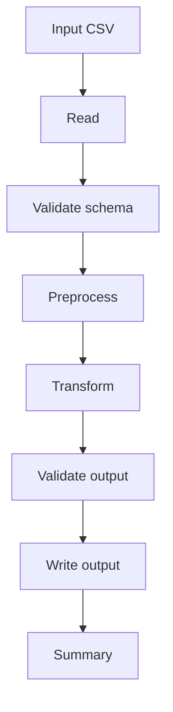

# Resumen
Se requiere implementar un flujo base reutilizable para procesamiento de datos tabulares, permitiendo validar, limpiar, transformar y generar salida estructurada para futuras tareas repetitivas.

# Objetivo
Contar con una base técnica reutilizable que acelere la implementación de procesos ETL simples y tareas de calidad de datos.

# Contexto
Actualmente no existe un molde estándar para scripts de datos dentro del kit, lo que genera retrabajo y diferencias de estructura entre implementaciones.
Se necesita una base común para facilitar mantenimiento, documentación y escalabilidad.

# Alcance
## Incluye
- script base de preprocesamiento
- script base de transformación ETL
- script base de carga
- utilitarios de logging y manejo de archivos
- ejemplos de input y output

## No incluye
- conexión a base de datos real
- scheduler
- interfaz gráfica

---

# Flujo completo

1. Leer archivo fuente.
2. Validar columnas requeridas.
3. Preprocesar estructura y valores.
4. Transformar datos según reglas básicas.
5. Validar dataset resultante.
6. Generar archivo final.
7. Registrar métricas.

## Diagrama Mermaid


---

# Funcionalidades implementadas

## 1. Preprocesamiento base
### Descripción
Se implementó una base para normalización de nombres de columnas, limpieza de strings, validación de columnas requeridas y eliminación de duplicados.

## 2. Transformación base
### Descripción
Se implementó una transformación genérica con normalización de `status`, tipado numérico de `amount` y derivación de categoría de monto.

## 3. Carga base
### Descripción
Se implementó un flujo de escritura a archivo de salida con validaciones previas y resumen estructurado.

## 4. Utilitarios comunes
### Descripción
Se añadieron helpers reutilizables para logging y lectura/escritura de CSV y JSON.

---

# Datos utilizados

## Archivos involucrados

| Archivo | Tipo | Rol dentro de la solución |
|---|---|---|
| `scripts/preprocess/preprocess_base.py` | Script | Limpieza y normalización inicial |
| `scripts/etl/etl_base.py` | Script | Orquestación del flujo ETL |
| `scripts/load/load_base.py` | Script | Carga o persistencia final |
| `scripts/utils/logger.py` | Utilitario | Logging reutilizable |
| `scripts/utils/file_utils.py` | Utilitario | Manejo de archivos |

## Columnas relevantes

| Campo | Origen | Tipo | Descripción |
|---|---|---|---|
| `customer_id` | input CSV | string | Identificador de cliente |
| `status` | input CSV | string | Estado del registro |
| `amount` | input CSV | numeric | Monto a clasificar |

---

# Input / Output

## Input esperado

| Campo | Tipo | Requerido | Descripción | Ejemplo |
|---|---|---|---|---|
| `source_path` | string | Sí | Ruta de archivo fuente | `data/input/customers.csv` |
| `output_path` | string | Sí | Ruta de salida | `data/output/customers_processed.csv` |

### Ejemplo de input
```json
{
  "source_path": "data/input/customers.csv",
  "output_path": "data/output/customers_processed.csv"
}
```

## Output esperado

| Salida | Tipo | Descripción | Ejemplo |
|---|---|---|---|
| `status` | string | Estado de ejecución | `success` |
| `records_loaded` | integer | Cantidad final cargada | `1148` |

### Ejemplo de output exitoso
```json
{
  "status": "success",
  "records_loaded": 1148
}
```

### Ejemplo de error esperado
```json
{
  "status": "error",
  "error_code": "MISSING_REQUIRED_COLUMNS",
  "message": "Missing required columns: customer_id, email"
}
```

---

# Formas de ejecución

## Opción 1: manual por script
Ejecutar desde terminal indicando input y output por parámetro.

## Opción 2: reutilización como base de otro script
Tomar los módulos y extender reglas específicas según proyecto.

---

# Casos / ejemplos representativos

## Caso feliz
Archivo CSV con columnas correctas, datos válidos y registros duplicados controlables.

## Caso con datos incompletos
Archivo con algunas columnas vacías, pero con posibilidad de limpieza parcial.

## Caso con error controlado
Archivo sin columnas requeridas.
Se devuelve error estructurado y no se genera salida final.

---

# Pendientes / trabajo futuro
- agregar soporte para Excel
- agregar configuración YAML
- agregar persistencia en base de datos
- agregar validaciones por esquema configurable

---

# Adjuntos / referencias / links
- `examples/input/sample_input.json`
- `examples/output/sample_output_success.json`
- `examples/output/sample_output_error.json`

---

# Resumen ejecutivo final
- Se definió una base reusable para procesamiento de datos.
- Se estandarizó el flujo de preprocesamiento, transformación y carga.
- Se incluyeron utilitarios comunes y ejemplos de entrada/salida.
- Se redujo el esfuerzo necesario para futuros scripts similares.

---

# Criterios de aceptación
- [x] Existe un script base de preprocesamiento.
- [x] Existe un script base ETL.
- [x] Existe un script base de carga.
- [x] Se documenta el flujo completo.
- [x] Existen ejemplos de input y output.
- [x] Se incluyen utilitarios reutilizables.
