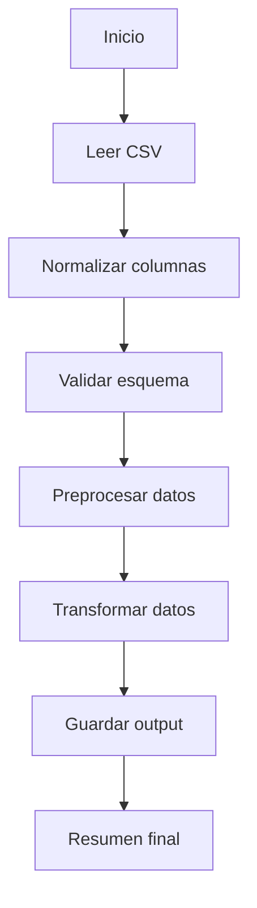

# Resumen ejecutivo

## ¿Qué cambia?
- Se implementa un nuevo flujo base de preprocesamiento y transformación de datos de clientes.
- Se normalizan columnas, se limpian valores string y se eliminan duplicados.
- Se agrega una clasificación básica del monto procesado en categorías.
- Se documenta el flujo técnico del script ETL y su contrato de entrada/salida.

## Objetivo
Estandarizar un flujo base reutilizable para procesamiento de archivos CSV, reduciendo tiempo de implementación futura en tareas repetitivas de datos.

## Alcance
Incluye el flujo de lectura, validación mínima, preprocesamiento, transformación y escritura de archivo de salida.
No incluye integración a base de datos ni ejecución por scheduler.

---

# Archivos modificados

| Archivo | Tipo de cambio | Descripción del cambio |
|---|---|---|
| `scripts/preprocess/preprocess_base.py` | Creado | Se agregó un script base para limpieza y normalización de datos de entrada. |
| `scripts/etl/etl_base.py` | Creado | Se implementó un flujo ETL base con validación, transformación y escritura de salida. |
| `scripts/utils/file_utils.py` | Creado | Se añadieron utilidades para lectura/escritura de archivos CSV y JSON. |
| `scripts/utils/logger.py` | Creado | Se agregó configuración reutilizable de logging. |

---

# Descripción detallada de los cambios

## 1. Preprocesamiento de datos
Se agregó una etapa de preprocesamiento que:
- normaliza nombres de columnas
- limpia espacios en strings
- convierte el campo `status` a minúsculas
- elimina duplicados
- valida columnas obligatorias antes de continuar

## 2. Transformación ETL
Se implementó una transformación base que:
- convierte `amount` a numérico
- completa valores inválidos con `0`
- genera una columna derivada `amount_category`
- clasifica registros en `high` o `standard`

## 3. Logging y utilidades
Se centralizó el logging en un utilitario reutilizable y se añadieron helpers para lectura/escritura de archivos.

---

# Flujo funcional / técnico

1. Se recibe un archivo CSV como input.
2. Se leen y normalizan las columnas.
3. Se validan columnas obligatorias.
4. Se limpian y transforman valores.
5. Se genera un archivo procesado.
6. Se devuelve un resumen de ejecución.

## Diagrama de flujo


---

# Datos, tablas o documentación utilizadas

| Recurso | Tipo | Uso dentro del cambio |
|---|---|---|
| `customers.csv` | Archivo CSV | Fuente de entrada del proceso |
| `sample_input.json` | JSON | Ejemplo de parámetros de ejecución |
| `sample_output_success.json` | JSON | Ejemplo de salida exitosa |

---

# Contrato funcional: input / output

## Input

| Campo | Tipo | Requerido | Descripción | Ejemplo |
|---|---|---|---|---|
| `process_date` | string | Sí | Fecha de procesamiento | `2026-03-17` |
| `source_path` | string | Sí | Ruta del archivo de entrada | `data/input/customers.csv` |
| `output_path` | string | Sí | Ruta del archivo de salida | `data/output/customers_processed.csv` |

### Ejemplo de input
```json
{
  "process_date": "2026-03-17",
  "source_path": "data/input/customers.csv",
  "output_path": "data/output/customers_processed.csv"
}
```

## Output

| Salida | Tipo | Descripción | Ejemplo |
|---|---|---|---|
| `status` | string | Estado final del proceso | `success` |
| `records_processed` | integer | Registros procesados | `1148` |
| `output_path` | string | Archivo generado | `data/output/customers_processed.csv` |

### Ejemplo de output exitoso
```json
{
  "status": "success",
  "records_processed": 1148,
  "output_path": "data/output/customers_processed.csv"
}
```

### Ejemplo de output con error
```json
{
  "status": "error",
  "error_code": "MISSING_REQUIRED_COLUMNS",
  "message": "Missing required columns: customer_id, email"
}
```

---

# Casos representativos

## Caso exitoso
Se recibe un CSV con columnas esperadas y datos limpios o corregibles.
El script procesa correctamente, elimina duplicados y genera archivo de salida.

## Caso de fallo controlado
Se recibe un archivo sin columnas obligatorias.
El flujo se detiene y devuelve un error estructurado indicando qué columnas faltan.

---

# Riesgos, consideraciones y compatibilidad
- Si el archivo cambia de estructura, se deben actualizar columnas obligatorias.
- La lógica actual asume CSV como formato de entrada.
- La carga final actualmente solo escribe a archivo, no a base de datos.

# Pendientes o siguientes pasos
- Incorporar lectura desde Excel.
- Incorporar carga a base de datos.
- Agregar configuración por archivo YAML.
