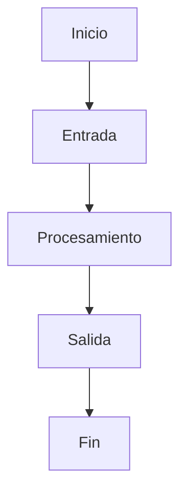

# Deep Analysis Template

## Resumen ejecutivo
Describe en pocas líneas qué se analizó, cuál es el propósito principal y qué hallazgos relevantes se encontraron.

## Objetivo del análisis
Explica por qué se realizó el análisis y qué preguntas busca responder.

## Alcance
### Incluye
-
-
-

### No incluye
-
-
-

---

## Contexto
Incluye aquí el contexto funcional o técnico relevante:
- requerimiento o ticket
- módulo o script analizado
- problema detectado
- flujo o proceso relacionado
- restricciones conocidas

---

## Mapa de componentes / archivos

| Archivo / módulo / componente | Tipo | Responsabilidad |
|---|---|---|
| `src/...` | Backend / Frontend / Script / Config | |
| `...` | | |

---

## Flujo funcional / técnico

Describe paso a paso cómo funciona actualmente el proceso o funcionalidad.

1.
2.
3.
4.

### Diagrama Mermaid

---

## Inputs / Outputs

### Inputs

| Input | Tipo | Requerido | Descripción | Ejemplo |
|---|---|---|---|---|
|  |  |  |  |  |

### Outputs

| Output | Tipo | Descripción | Ejemplo |
|---|---|---|---|
|  |  |  |  |

---

## Dependencias e integraciones

| Recurso | Tipo | Uso |
|---|---|---|
| Base de datos / API / archivo / servicio | | |

---

## Reglas de negocio inferidas

-
-
-

---

## Hallazgos principales

### Hallazgos funcionales
-
-
-

### Hallazgos técnicos
-
-
-

### Hallazgos de documentación
-
-
-

---

## Riesgos, vacíos y deuda técnica

| Tipo | Descripción | Impacto | Recomendación |
|---|---|---|---|
| Riesgo | | | |
| Deuda técnica | | | |
| Vacío documental | | | |

---

## Preguntas abiertas
-
-
-

---

## Recomendaciones
-
-
-

---

## Próximos pasos
1.
2.
3.
