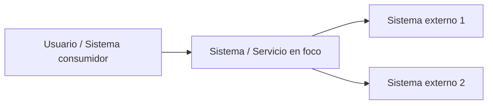
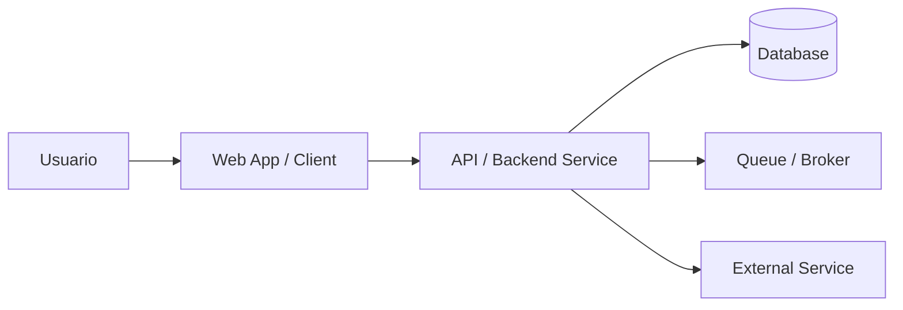
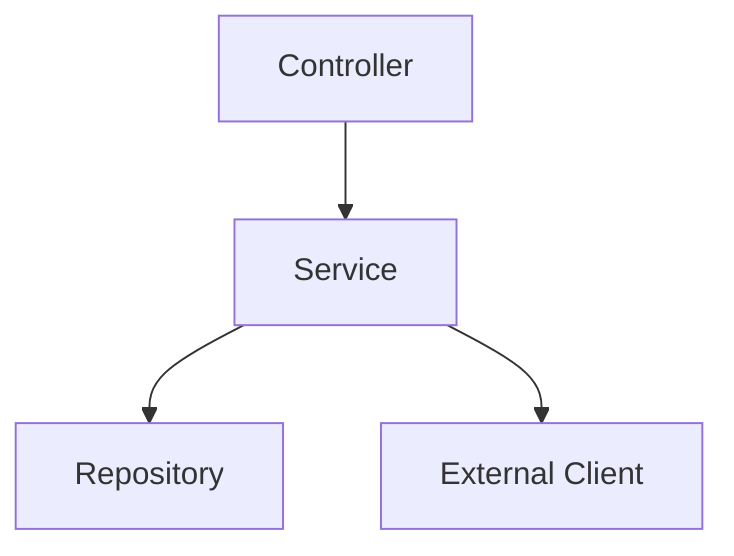
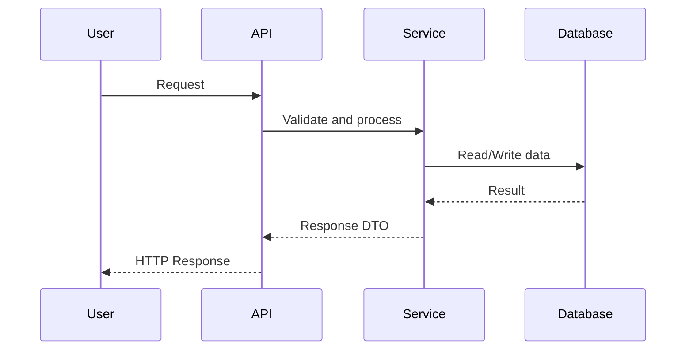
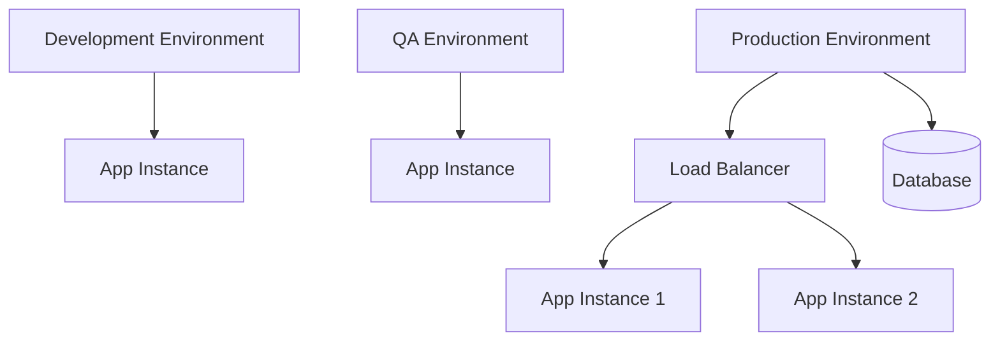

# Architecture Document Template

## Resumen ejecutivo
Describe brevemente el sistema, su propósito y los aspectos más importantes de la arquitectura.

## Objetivo y alcance
### Objetivo
Explica qué sistema, servicio o microservicio se documenta y para qué sirve esta documentación.

### Alcance
#### Incluye
-
-
-

#### No incluye
-
-
-

---

## Contexto del sistema
Describe:
- actores principales
- usuarios o consumidores
- sistemas externos
- dominio funcional
- límites del sistema

### Vista de contexto

---

## Drivers arquitectónicos
Incluye requerimientos o motivadores importantes:
- disponibilidad
- mantenibilidad
- escalabilidad
- seguridad
- rendimiento
- integración
- trazabilidad

| Driver | Descripción | Impacto en arquitectura |
|---|---|---|
|  |  |  |

---

## Restricciones y supuestos

### Restricciones
-
-
-

### Supuestos
-
-
-

---

## Vista de contenedores
Describe los contenedores principales dentro del sistema: aplicaciones, APIs, bases de datos, workers, colas, almacenamiento, etc.

| Contenedor | Tecnología | Responsabilidad | Comunicación |
|---|---|---|---|
| API |  |  |  |
| DB |  |  |  |

### Diagrama de contenedores

---

## Vista de componentes
Usa esta sección si un contenedor requiere más detalle interno.

| Componente | Responsabilidad | Entradas | Salidas |
|---|---|---|---|
| Controller / Handler | | | |
| Service | | | |
| Repository / Client | | | |

### Diagrama de componentes

---

## Flujos principales / vista runtime

### Flujo principal
1.
2.
3.
4.

### Diagrama dinámico

---

## Vista de despliegue
Documenta ambientes o nodos relevantes si aplica.

| Nodo / ambiente | Tipo | Contenedores desplegados | Notas |
|---|---|---|---|
| Dev |  |  |  |
| QA |  |  |  |
| Prod |  |  |  |

### Diagrama de despliegue

---

## Datos e integraciones

### Integraciones externas

| Integración | Tipo | Propósito | Protocolo / medio |
|---|---|---|---|
|  | API / DB / Queue / File |  |  |

### Datos relevantes

| Entidad / tabla / recurso | Descripción | Uso |
|---|---|---|
|  |  |  |

### Contratos relevantes

| Contrato | Input | Output | Consumidor |
|---|---|---|---|
| Endpoint / evento / archivo |  |  |  |

---

## Decisiones arquitectónicas relevantes
Lista decisiones importantes o referencia ADRs.

| Decisión | Motivo | Trade-off | Estado |
|---|---|---|---|
|  |  |  | Proposed / Accepted / Deprecated |

---

## Riesgos, trade-offs y deuda técnica

| Tipo | Descripción | Impacto | Mitigación |
|---|---|---|---|
| Riesgo |  |  |  |
| Trade-off |  |  |  |
| Deuda técnica |  |  |  |

---

## Observabilidad, seguridad y escalabilidad

### Observabilidad
- logging
- métricas
- tracing
- alertas

### Seguridad
- autenticación
- autorización
- secretos
- cifrado
- auditoría

### Escalabilidad y resiliencia
- escalado horizontal o vertical
- caché
- colas
- retries
- circuit breakers
- tolerancia a fallos

---

## Glosario

| Término | Definición |
|---|---|
|  |  |

---

## Referencias
- repositorios
- ADRs
- documentación relacionada
- diagramas
- tickets
