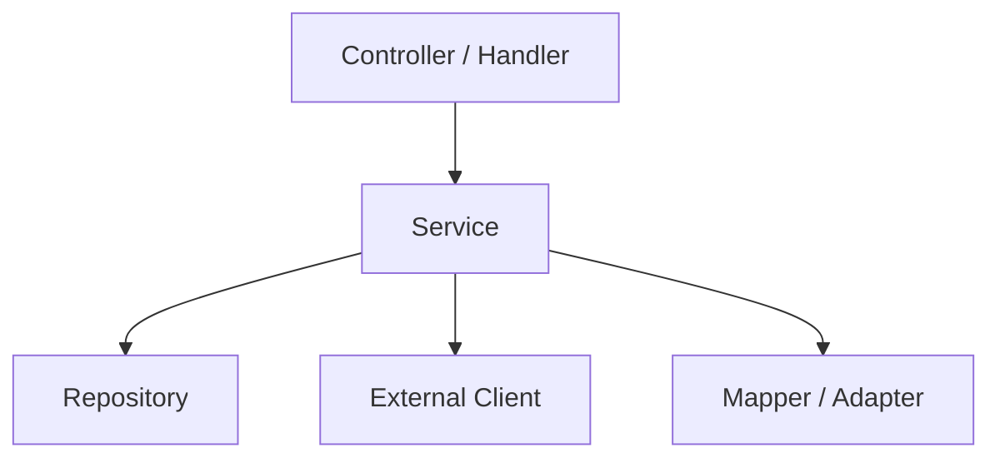

# Component Diagram Template

## Objetivo
Mostrar componentes internos relevantes dentro de un contenedor.

## Diagrama

## Qué documentar
- responsabilidad de cada componente
- dependencias internas
- límites entre capas
- puntos de entrada y salida
