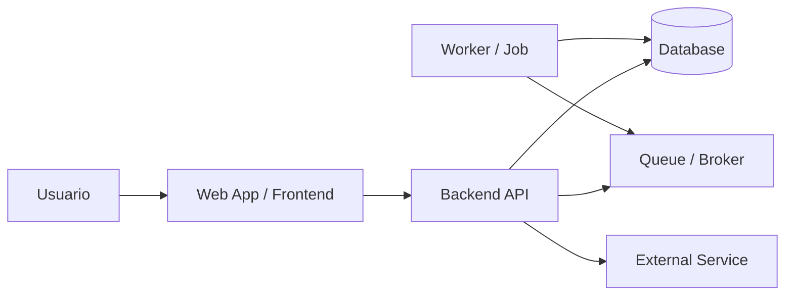

# Container Diagram Template

## Objetivo
Mostrar los contenedores principales del sistema y cómo se comunican.

## Diagrama

## Qué documentar
- responsabilidad de cada contenedor
- tecnología principal
- protocolo o medio de comunicación
- datos o eventos intercambiados
