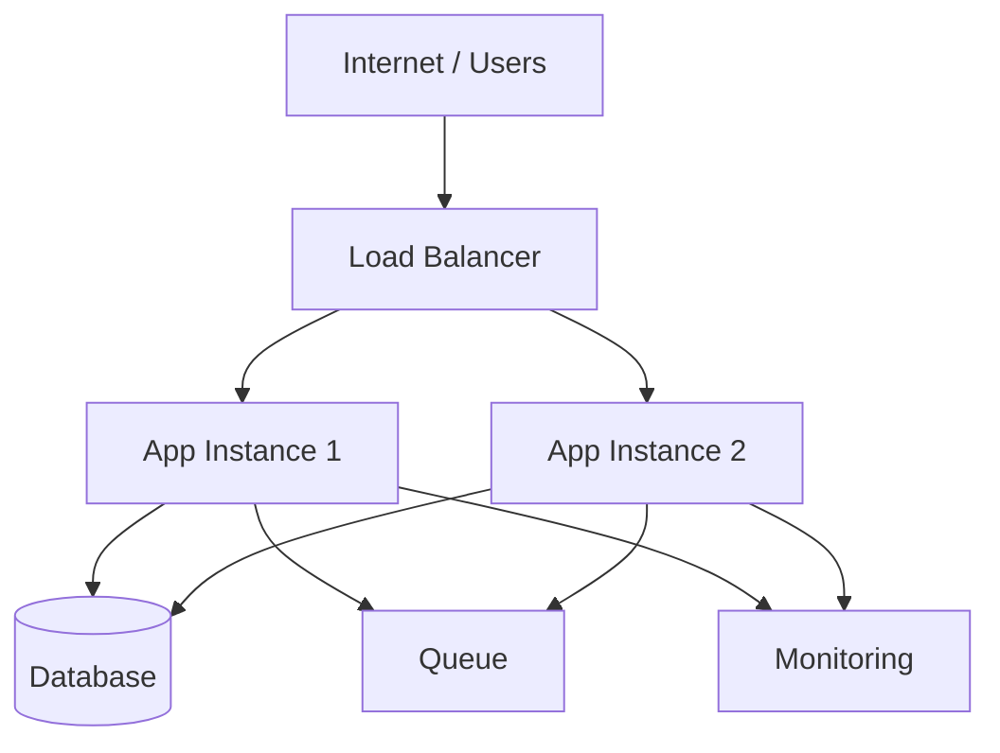

# Deployment Diagram Template

## Objetivo
Mostrar cómo se despliega el sistema en ambientes o nodos relevantes.

## Diagrama

## Qué documentar
- ambientes relevantes
- nodos o servicios desplegados
- componentes compartidos
- escalado y alta disponibilidad si aplica
