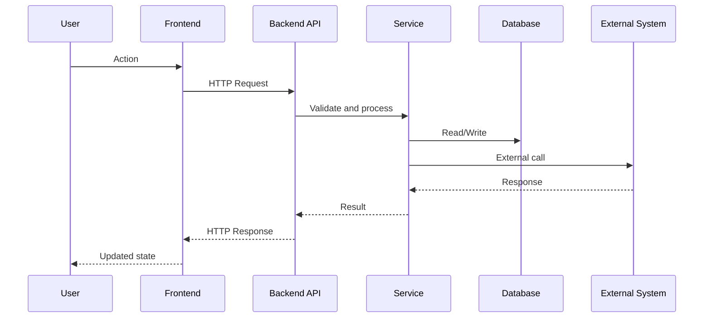

# Dynamic Diagram Template

## Objetivo
Mostrar un flujo relevante paso a paso entre actores, componentes o servicios.

## Diagrama

## Qué documentar
- flujo principal
- orden de llamadas
- sincronía o asincronía si importa
- puntos de fallo o dependencias críticas
