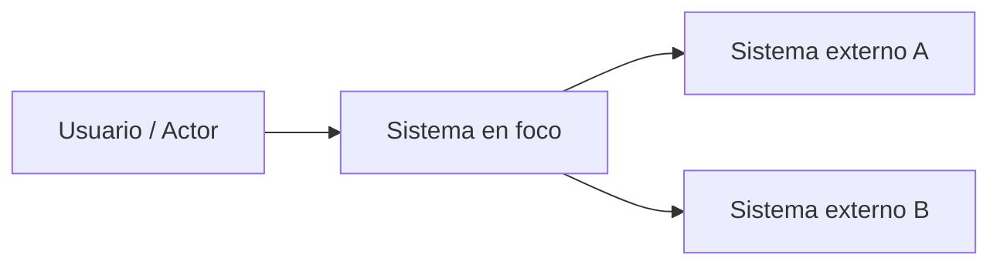

# System Context Template

## Objetivo
Mostrar el sistema en foco, sus actores y los sistemas externos con los que interactúa.

## Diagrama

## Qué documentar
- quién usa el sistema
- qué sistemas externos consume o expone
- límites del sistema
- propósito de cada relación
