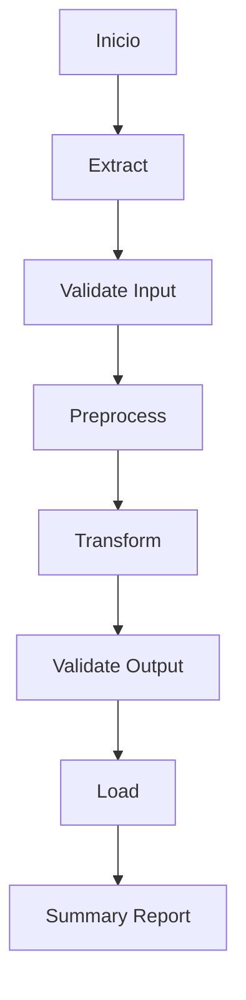

# ETL Template

## Resumen
Describe el objetivo general del flujo ETL y qué problema resuelve.

## Objetivo
Explica qué datos procesa, desde dónde vienen y hacia dónde van.

## Alcance
### Incluye
- extracción
- validación
- preprocesamiento
- transformación
- carga
- logging y resumen de ejecución

### No incluye
-
-
-

---

## Flujo general

1. Extraer datos desde la fuente.
2. Validar estructura mínima.
3. Preprocesar datos.
4. Transformar según reglas de negocio.
5. Validar output transformado.
6. Cargar al destino final.
7. Registrar métricas y resultado.

### Diagrama Mermaid


---

## Fuente y destino

| Elemento | Tipo | Descripción |
|---|---|---|
| Fuente | archivo / API / tabla | |
| Destino | archivo / API / tabla | |

---

## Contrato de entrada

| Campo / parámetro | Tipo | Requerido | Descripción | Ejemplo |
|---|---|---|---|---|
|  |  |  |  |  |

### Ejemplo de input
```json
{
  "process_date": "2026-03-17"
}
```

---

## Contrato de salida

| Salida | Tipo | Descripción | Ejemplo |
|---|---|---|---|
|  |  |  |  |

### Ejemplo de output exitoso
```json
{
  "status": "success",
  "records_processed": 100
}
```

### Ejemplo de output con error
```json
{
  "status": "error",
  "error_code": "INVALID_SCHEMA",
  "message": "Missing required columns"
}
```

---

## Estructura sugerida

| Archivo / módulo | Responsabilidad |
|---|---|
| `main.py` | Orquestación del flujo ETL |
| `extract.py` | Lectura de datos |
| `preprocess.py` | Limpieza inicial |
| `transform.py` | Reglas de transformación |
| `load.py` | Persistencia final |
| `validators.py` | Validaciones |
| `config.yml` | Configuración |
| `logger.py` | Logging |

---

## Reglas de negocio
-
-
-

---

## Validaciones
-
-
-

---

## Logging y métricas esperadas

| Métrica | Descripción |
|---|---|
| `records_read` | Cantidad de registros leídos |
| `records_valid` | Registros válidos |
| `records_rejected` | Registros rechazados |
| `records_loaded` | Registros cargados |
| `duration_seconds` | Duración total |

---

## Riesgos y consideraciones
-
-
-

---

## Pendientes
-
-
-
