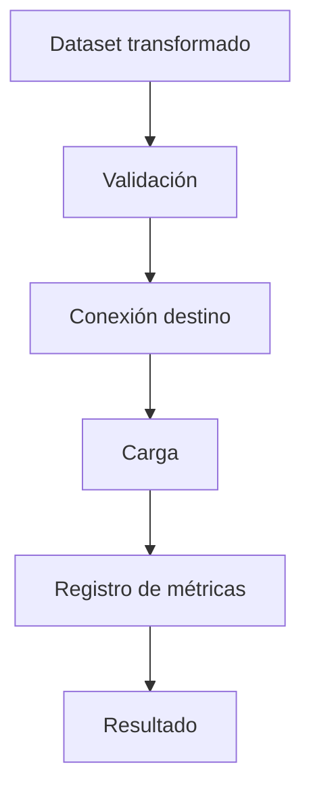

# Data Load Template

## Resumen
Describe el objetivo de la carga y el destino final de los datos.

## Objetivo
Explica qué dataset se cargará, a dónde se cargará y con qué estrategia.

---

## Destino final

| Recurso | Tipo | Descripción |
|---|---|---|
|  | tabla / API / archivo |  |

---

## Estrategia de carga

| Estrategia | Descripción | Cuándo usar |
|---|---|---|
| insert | inserción simple | datos nuevos |
| append | agregar al final | históricos |
| update | actualizar existentes | cuando hay llave |
| upsert | insertar o actualizar | cargas incrementales |

---

## Validaciones previas
- validar dataset no vacío
- validar columnas requeridas
- validar esquema destino
- validar llaves o campos obligatorios
- validar tipos y formato si aplica

---

## Contrato de entrada

| Campo / parámetro | Tipo | Requerido | Descripción | Ejemplo |
|---|---|---|---|---|
|  |  |  |  |  |

---

## Contrato de salida

| Output | Tipo | Descripción | Ejemplo |
|---|---|---|---|
| status | string | resultado final | `success` |
| loaded_records | integer | cantidad cargada | `1400` |
| failed_records | integer | cantidad fallida | `15` |

---

## Ejemplo de resultado exitoso
```json
{
  "status": "success",
  "loaded_records": 1400,
  "failed_records": 0
}
```

## Ejemplo de error controlado
```json
{
  "status": "error",
  "error_code": "DESTINATION_SCHEMA_MISMATCH",
  "message": "Column type mismatch detected"
}
```

---

## Flujo de carga
1. Validar dataset transformado.
2. Preparar estructura final.
3. Conectar al destino.
4. Ejecutar estrategia de carga.
5. Registrar métricas.
6. Emitir resultado final.

### Diagrama Mermaid


---

## Métricas esperadas

| Métrica | Descripción |
|---|---|
| loaded_records | registros cargados |
| failed_records | registros fallidos |
| execution_time | tiempo total |
| destination | recurso destino |

---

## Riesgos y consideraciones
-
-
-

---

## Pendientes
-
-
-
