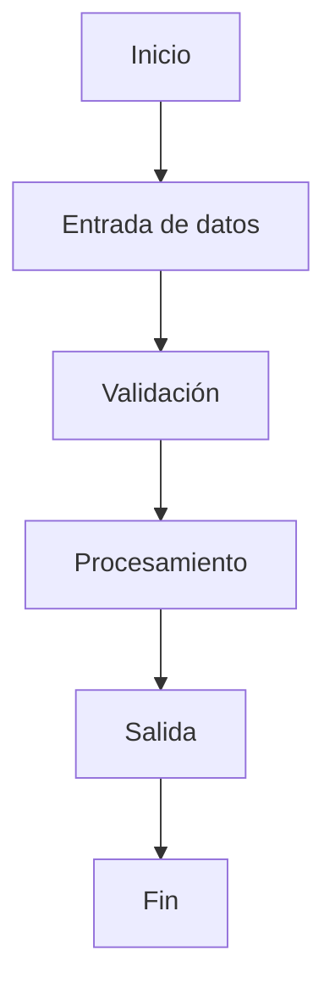

# Resumen
Describe brevemente la necesidad, el problema y la solución propuesta.

# Objetivo
Explica qué se busca lograr con esta implementación o cambio.

# Contexto
Incluye antecedentes funcionales o técnicos necesarios para entender el ticket:
- proceso actual
- problema actual
- limitaciones actuales
- necesidad del negocio o del sistema

# Alcance
## Incluye
-
-

## No incluye
-
-

---

# Flujo completo

## Descripción del flujo
Explica paso a paso cómo funciona la solución de inicio a fin.

1.
2.
3.
4.

## Diagrama Mermaid


---

# Funcionalidades implementadas

## 1. [Nombre de funcionalidad]
### Descripción
Explica con detalle qué hace.

### Comportamiento esperado
Explica cómo debe comportarse bajo condiciones normales.

### Reglas relevantes
-
-

## 2. [Nombre de funcionalidad]
...

---

# Datos utilizados

## Archivos involucrados

| Archivo | Tipo | Rol dentro de la solución |
|---|---|---|
| `src/process.py` | Script | Ejecuta la transformación principal |
| `config/process.yml` | Configuración | Define parámetros de entrada y salida |

## Tablas / entidades / datasets

| Recurso | Tipo | Descripción | Uso |
|---|---|---|---|
| `schema.orders` | Tabla | Órdenes fuente | Lectura |
| `schema.orders_clean` | Tabla | Órdenes normalizadas | Escritura |

## Columnas / campos relevantes

| Campo | Origen | Tipo | Descripción |
|---|---|---|---|
| `order_id` | `schema.orders` | string | Identificador de orden |
| `created_at` | `schema.orders` | datetime | Fecha de creación |

---

# Input / Output

## Input esperado

| Campo | Tipo | Requerido | Descripción | Ejemplo |
|---|---|---|---|---|
| `process_date` | string | Sí | Fecha de ejecución | `2026-03-17` |

### Ejemplo de input
```json
{
  "process_date": "2026-03-17"
}
```

## Output esperado

| Salida | Tipo | Descripción | Ejemplo |
|---|---|---|---|
| `generated_records` | integer | Registros generados | `420` |
| `output_path` | string | Ruta de salida | `/tmp/output.csv` |

### Ejemplo de output exitoso
```json
{
  "status": "success",
  "generated_records": 420,
  "output_path": "/tmp/output.csv"
}
```

### Ejemplo de error esperado
```json
{
  "status": "error",
  "code": "MISSING_REQUIRED_COLUMN",
  "message": "No se encontró la columna order_id"
}
```

---

# Formas de ejecución

## Opción 1: ejecución manual
Explica cómo correrlo manualmente.

## Opción 2: ejecución por task / scheduler / pipeline
Explica cómo corre en otro contexto.

## Opción 3: ejecución mediante parámetro/configuración alternativa
Si aplica, detállala.

---

# Casos / ejemplos representativos

## Caso feliz
Describe el escenario y el resultado esperado.

## Caso con datos incompletos
Describe el escenario y el comportamiento esperado.

## Caso con error controlado
Describe el escenario y la respuesta esperada.

---

# Pendientes / trabajo futuro

-
-
-

---

# Adjuntos / referencias / links

- Documentación:
- Diseño:
- Querys:
- Dashboards:
- PR relacionada:
- Recursos adicionales:

---

# Resumen ejecutivo final
Resume en bullets qué aporta esta funcionalidad.

-
-
-

---

# Criterios de aceptación

- [ ] La solución procesa correctamente el input esperado.
- [ ] La validación detecta inputs inválidos o incompletos.
- [ ] El flujo genera el output esperado en el formato definido.
- [ ] Se documentan archivos, tablas, columnas o recursos utilizados.
- [ ] Se describen casos de éxito y fallo.
- [ ] Se explican las formas de ejecución disponibles.
- [ ] Se incluye el flujo completo con diagrama Mermaid.
- [ ] La funcionalidad queda descrita de forma clara para equipo técnico y funcional.
