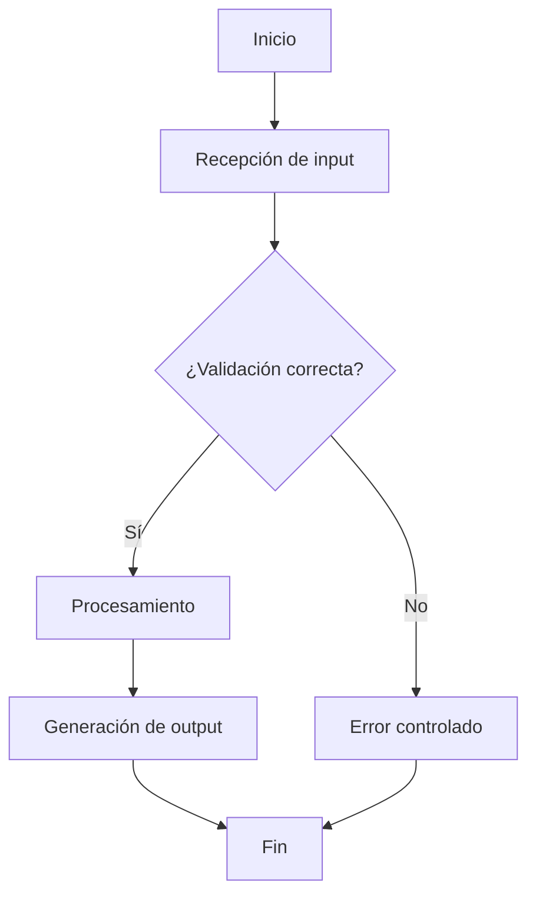
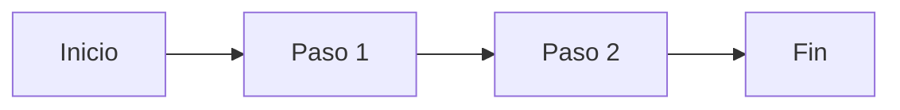
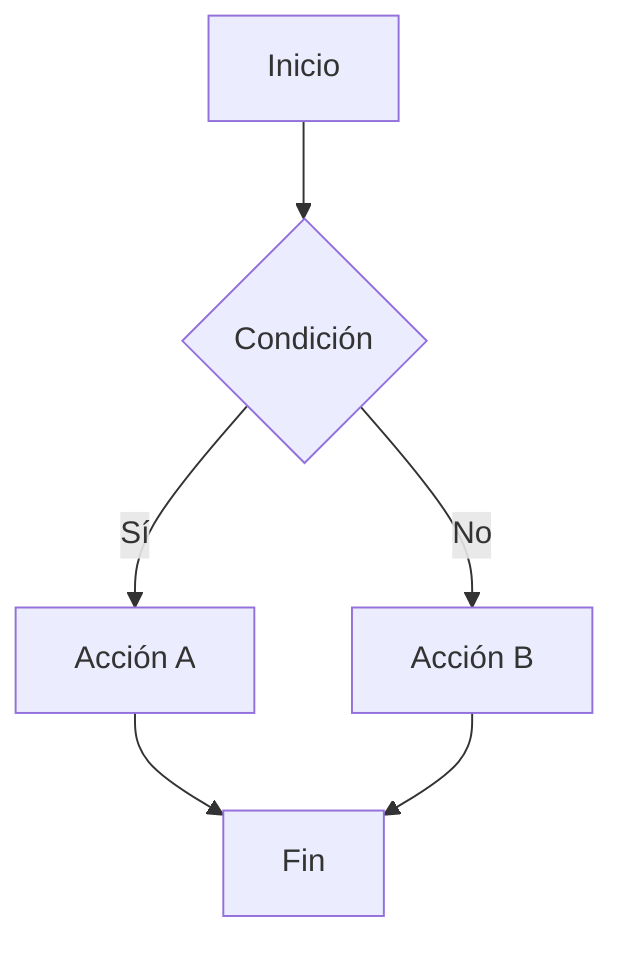
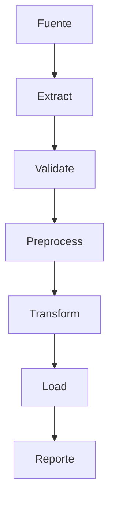

# Mermaid Flowchart Template

## Plantilla base

## Variantes útiles

### Flujo lineal

### Flujo con decisiones

### Flujo ETL

## Buenas prácticas
- Usa nombres cortos pero claros.
- No hagas diagramas gigantes si pueden dividirse.
- Usa decisiones solo cuando aporten claridad.
- Mantén consistencia en nombres de pasos.
