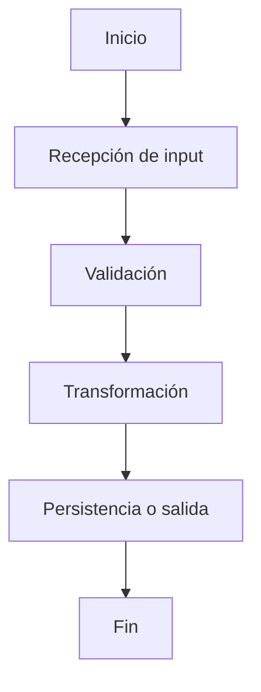

# Resumen

## ¿Qué cambia?
Describe en 3 a 6 bullets el cambio principal, el problema que resuelve y el impacto funcional/técnico.

-
-
-

## Objetivo
Explica el propósito del cambio y qué necesidad cubre.

## Alcance
Detalla qué parte del sistema fue impactada y qué queda fuera de alcance.

---

# Archivos modificados

| Archivo | Tipo de cambio | Descripción del cambio |
|---|---|---|
| `ruta/archivo1.ts` | Modificado | Se ajustó la validación de entrada para contemplar valores nulos y normalización de formato. |
| `ruta/archivo2.py` | Creado | Nuevo script de transformación para consolidar columnas y generar salida normalizada. |

> Tipos de cambio sugeridos: `Creado`, `Modificado`, `Eliminado`, `Renombrado`

---

# Descripción detallada de los cambios

## 1. [Nombre de la funcionalidad o ajuste]
Explica claramente:
- qué se implementó
- por qué se implementó
- cómo funciona a nivel funcional
- qué reglas aplica
- qué condiciones contempla
- qué impacto tiene sobre otros módulos

## 2. [Siguiente cambio]
...

---

# Flujo funcional / técnico

Describe paso a paso el flujo general del proceso, evitando enfocarte demasiado en código.

1.
2.
3.
4.

## Diagrama de flujo


> Incluir este diagrama especialmente cuando se trate de scripts nuevos, procesos batch, ETLs, integraciones o flujos multi-etapa. Mermaid es una forma válida y ampliamente usada para documentar flujos. ([mermaid.js.org](https://mermaid.js.org/syntax/flowchart.html?utm_source=openai))

---

# Datos, tablas o documentación utilizadas

## Fuentes de datos / tablas impactadas

| Recurso | Tipo | Uso dentro del cambio |
|---|---|---|
| `schema.clientes` | Tabla | Fuente principal para lectura de datos de cliente |
| `docs/proceso_x.md` | Documento | Referencia funcional del flujo esperado |

## Campos / columnas relevantes

| Campo / columna | Origen | Tipo | Descripción |
|---|---|---|---|
| `customer_id` | `schema.clientes` | string | Identificador único del cliente |
| `status` | `schema.clientes` | string | Estado del cliente usado para filtrado |

---

# Contrato funcional: input / output

## Input
Describe qué recibe el componente/script/proceso.

| Campo | Tipo | Requerido | Descripción | Ejemplo |
|---|---|---|---|---|
| `fecha_proceso` | string | Sí | Fecha a procesar en formato ISO | `2026-03-17` |
| `source_path` | string | No | Ruta de archivo fuente | `/data/input.csv` |

### Ejemplo de input
```json
{
  "fecha_proceso": "2026-03-17",
  "source_path": "/data/input/clientes.csv"
}
```

## Output
Describe qué devuelve o genera.

| Salida | Tipo | Descripción | Ejemplo |
|---|---|---|---|
| `output_file` | archivo | Archivo procesado con datos transformados | `clientes_normalizados.csv` |
| `records_processed` | integer | Cantidad de registros procesados | `1250` |

### Ejemplo de output exitoso
```json
{
  "status": "success",
  "output_file": "clientes_normalizados.csv",
  "records_processed": 1250
}
```

### Ejemplo de output con error
```json
{
  "status": "error",
  "error_code": "INVALID_INPUT_SCHEMA",
  "message": "Faltan columnas obligatorias: customer_id, status"
}
```

---

# Reglas de negocio o comportamiento relevante

-
-
-

---

# Casos representativos

## Caso exitoso
**Escenario:**
Describe un ejemplo concreto donde el flujo funciona correctamente.

**Resultado esperado:**
Describe el output o comportamiento esperado.

## Caso de fallo controlado
**Escenario:**
Describe una entrada inválida, dato faltante o excepción contemplada.

**Resultado esperado:**
Describe cómo falla, qué mensaje entrega o cómo se registra el error.

---

# Riesgos, consideraciones y compatibilidad

- Posibles impactos colaterales
- Dependencias técnicas o funcionales
- Restricciones
- Supuestos
- Compatibilidad hacia atrás si aplica

---

# Pendientes o siguientes pasos

-
-
-

---

# Referencias

- Documentación:
- Diagramas:
- Consultas SQL:
- Diseños:
- Links relacionados:
